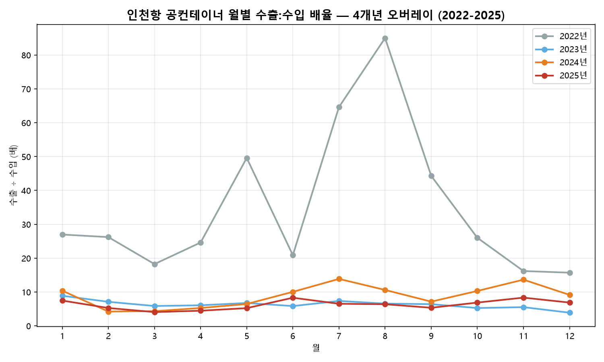

# 인천항을 공공 1차 데이터로 확인한다

말해진 명제 하나를 고르고, 공공 API·정부 통계·공표자료의 원시 데이터로 성립하는지 판정한다. 기준은 데이터를 받기 전에 커밋하고, 못 미친 것도 FAIL 그대로 발행한다.

[측심 사이트 보기](https://sounding.higgsfield.app/) [보고서 목록](#보고서)

각 편은 **핵심 요약 → 분석 결과(차트·표) → 해석 → 한계·후속** 순서이고, 결론 자리의 모든 수치는 이 저장소의 원시 CSV 와 코드에서 다시 계산된다. 이 저장소는 [측심](https://sounding.higgsfield.app/) 시리즈의 **원문 · 원시 데이터 · 재현 코드**를 든다. [데이터와 재현](https://sounding.higgsfield.app/#data) · [기준과 판정](https://sounding.higgsfield.app/#verdicts).

## 보고서

- [**#01** 인천항 공컨테이너 물동량: 2025년 월별 동향과 외국적 선사 편중](reports/report_01_공컨테이너_물동량.md)
  연간 991,170 TEU, 외국적 선사 88.2%, 2월 물동량은 전월 대비 -31.2%.
- [**#02** 인천항 컨테이너의 28.8%는 빈 컨테이너: 재배치 부담의 정량 검증](reports/report_02_공컨테이너_비율.md)
  전체 컨테이너의 약 28.8%가 빈 컨테이너. 수입 초과·재배치 부담 구조.
- [**#03** 인천항 빈 컨테이너의 85.1%는 수출 방향: 불균형의 방향 규명](reports/report_03_공컨테이너_수출입방향.md)
  빈 컨테이너의 85.1%가 수출 방향(수입의 6.1배). 불균형의 방향을 정량으로 확정.
- [**#04** 인천항 공컨테이너 불균형의 지속성: 연도별 추세 (2022~2025)](reports/report_04_공컨테이너_연도별추세.md)
  48개월 전부 수출 방향 우위(월별 최소 3.9배). 특정 연도의 사건이 아니라 구조.
- [**#05** 인천항 컨테이너 수지: 적컨은 수입, 공컨은 수출 (2022~2024)](reports/report_05_컨테이너_수지.md)
  전체는 방향 균형(1.0배)이지만 공컨을 빼면 적컨은 수입 우위(2배 안팎). 공컨의 수출 쏠림과 정반대 방향.
- [**#06** 인천항 공컨테이너 규격과 방향의 비대칭: 수입 공컨은 40ft로 쏠린다 (2022~2025)](reports/report_06_공컨테이너_규격방향.md)
  수입 공컨의 40ft 비중 91.1% 대 수출 52.4%(2025년·박스 수 기준), 격차 +38.7%p. 48개월 중 42개월 성립.
- [**#07** 인천항 공컨테이너 표본외 검증: 45개월째 깨지지 않았다 (2026-01~06)](reports/report_07_공컨테이너_표본외검증.md)
  기준 4개를 데이터 수집 전에 커밋하고 그대로 판정, 4개 전부 PASS. 40ft 비중 격차 부호 45개월 연속, 상반기 합산 격차 +34.4%p, 6월 배율 8.642. 기준 무수정·사후조정 0건.
- [**#08** 인천항, 다른 기관 소스로 다시 봤다: 20개월 전 구간 수입 우위 (2024-12~2026-07)](reports/report_08_관세청_인천항_수출입신고.md)
  관세청 「항구·공항별 수출입실적」에서 금액·건수 둘 다 수입 우위가 20개월 창 전 구간에서 관측. 값은 맞대지 않고 부호만 맞댔다. 두 소스는 단위·모집단·집계 주체가 전부 다르다.
- [**#09** 인천항 공컨테이너 시계열 17년 연장: 우리가 이례로 봤던 해는 이례가 아니었다 (2005~2021)](reports/report_09_공컨테이너_시계열연장.md)
  원천은 2022년이 아니라 2005년부터 있었다. 기준 4개 중 V1·V2 PASS, V3·V4 FAIL. 2022년의 27.32배는 최대가 아니었다(2020년 54.66배). 판정 불가 10개 연도는 따로 셌다.

**#10 은 편으로 안 나왔다.** 기준 4개(W1~W4)를 커밋해 204개월을 월 단위로 판정했고 **W1 PASS · W2·W3·W4 FAIL** 이다. 판정과 그 근거는 [`docs/10_판정결과.md`](docs/10_판정결과.md) 가 든다 — **보고서 편만 아직 안 썼다.** 측심 판정표의 `#10 W1~W4` 네 줄이 이 문서를 가리킨다.

발행된 편은 한 줄로 이어진다. 관찰에서 기준 FAIL 공개까지.

1. **#01 관찰** 「공컨 비중이 높다」는 관찰을 제시했다.
2. **#02 검증** 전체 물동량 대비 28.8%라는 비율로 검증했다.
3. **#03 규명** 그 불균형의 방향(85.1% 수출 방향)을 규명했다.
4. **#04 지속성** 이 구조가 2022~2025년 48개월 내내 지속됨을 확인했다.
5. **#05 수지** 전체에서 공컨을 빼면 적컨이 수입으로 쏠린다는 거울상(공컨 수출 쏠림의 반대)을 확인했다.
6. **#06 규격** 규격(크기) 축을 처음 열어, 수입 공컨은 40ft에 쏠리고 수출 공컨은 혼합 구성이라는 비대칭이 48개월 중 42개월에서 성립함을 확인했다.
7. **#07 표본외 검증** 그 결론들을 **그 데이터 밖에 놓아** 2026년 상반기로 검증했다(기준 4개 사전 커밋, 전부 PASS).
8. **#08 타 기관 교차 확인** 처음으로 **다른 기관의 다른 신고 체계**를 열어 #05의 「적컨은 수입」을 부호 수준에서 교차 확인했다.
9. **#09 시계열 연장 · 기준 FAIL 공개** 원천의 시작이 2005년임을 확인해 같은 기준을 **17년 뒤로** 늘렸고, 그 기준 둘이 FAIL 로 났으며 **FAIL 그대로 실었다**.



## 검증 방식

- 모든 발행 수치는 저장소에 커밋된 수집 원시 CSV에서 재현 가능하다. 재현 환경은 Python(requests·pandas·matplotlib)이고, 수집은 공공데이터 Open API(XML)와 hwpx 공표자료(zipfile+XML)를 **헤더명 기준**으로 파싱한다(연도별 스키마 차이 대응). 사멸한 API 문서는 Wayback Machine 에서 복원했다.
- 발행 전 검증 게이트를 통과한다: 기존 발행 수치와의 회귀 대조, 스키마·완결성 확인, 내적 검산(방향합=총합, 규격 환산식). 이중 실행 환경 교차검증(X-CHECK)은 가용할 때 쓰고, 못 쓰면 못 썼다고 적는다.
- 오류는 삭제하지 않고 정정 표기로 남긴다. 판정 기준은 결과 확인 전에 문서로 선커밋한다(`docs/` 의 주제검증·판정결과 문서 참조).

## 데이터 출처

- **공공데이터포털(data.go.kr)**: 인천항만공사 공컨테이너 화물 통계 API
- **인천지방해양수산청**: 「인천항 물동량」 월별 공표 통계 (전체 컨테이너 물동량)
- **관세청**: 「항구·공항별 수출입실적」 (공공데이터포털, #08)

## 저장소 구조

```
.
├── README.md          # 이 파일 — 보고서 목록
├── reports/           # 분석 보고서 (+ images/ 차트)
│   ├── report_01_공컨테이너_물동량.md
│   ├── report_02_공컨테이너_비율.md
│   ├── report_03_공컨테이너_수출입방향.md
│   ├── report_04_공컨테이너_연도별추세.md
│   ├── report_05_컨테이너_수지.md
│   ├── report_06_공컨테이너_규격방향.md
│   ├── report_07_공컨테이너_표본외검증.md
│   ├── report_08_관세청_인천항_수출입신고.md
│   └── report_09_공컨테이너_시계열연장.md
├── analysis/          # 재현용 코드·데이터 (config.py는 .gitignore로 제외)
└── docs/              # 선커밋 판정 기준 · 판정 결과 · 수치 대장(FACTS) · 사고 기록
```

재현 방법은 각 보고서의 「재현 방법」 절을 참고한다(코드는 모두 `analysis/` 폴더에서 실행).

---

## 표기

| 항목 | 내용 |
|---|---|
| **주제 · 축 · 판정 기준** | **운영자**. 무엇을 재고 어떤 기준으로 판정할지를 정한다. **발행물의 책임은 운영자에게 있다.** |
| **수집·계산·차트·검사·발행** | 코드. `analysis/` 전량 공개. 발행 린터·치환 가드·앵커 검사 포함 |
| **검수** | 기계가 무작위로 뽑은 수치 1건을 원본과 대조하고 `docs/검수기록.md`에 남긴다. **기록이 없는 편에는 검수 표기를 달지 않는다** — 「아직 하지 않았다」고 적힌 편이 있다. *(2026-09-09 정정: 이 행은 종전에 「검수·발행: 운영자」로 적혀 있었다.)* |
| **데이터 출처** | 공공데이터포털 인천항만공사 공컨테이너 화물 통계 API · 인천지방해양수산청 공표 통계 · 관세청 「항구·공항별 수출입실적」 |

독자의 첫 질문은 "그 숫자 진짜냐"다. 원시 데이터와 재현 코드의 공개가 그 질문에 답하는 유일한 수단이고, 그래서 전량 공개한다.
