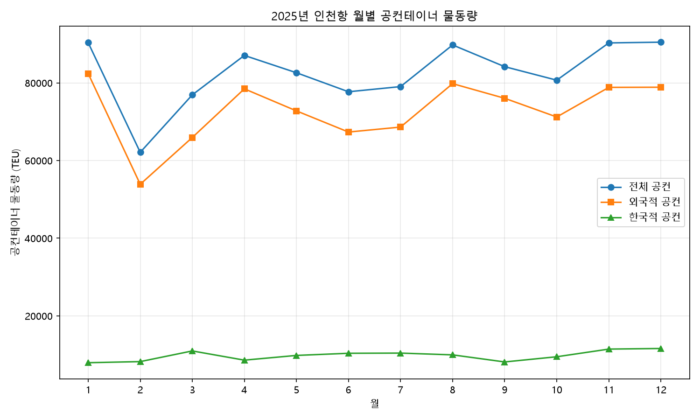

# 보고서 #01 — 인천항 공컨테이너 물동량: 2025년 월별 동향과 외국적 선사 편중

> 인천항을 드나드는 빈 컨테이너의 88%가 외국적 선사 소유였다. 무엇을 뜻하는가.

- **작성일**: 2026-07-08
- **분석 대상**: 2025년 1~12월 인천항 공(빈)컨테이너 수출입 실적(TEU)
- **한 줄 결론**: 공컨 물동량의 88.2%가 외국적 선사 컨테이너 — 근해 항로 구조와 수출입 불균형의 신호

---

## 1. 핵심 요약

- **2025년 인천항 공(빈)컨테이너 물동량은 연간 991,170 TEU**이며, 이 중 **외국적 선사 컨테이너가 88.2%**(874,171 TEU)로 절대다수를 차지한다.
- **2월이 62,115 TEU로 연중 최저**로, 직전 1월 대비 **-31.2%** 급감했다. 설 연휴에 따른 조업일수 감소 효과로 해석할 수 있다.
- 이후 등락을 거치며 하반기로 갈수록 회복해 **12월 90,479 TEU로 연중 최고**를 기록했다. 공컨 비중이 높다는 점은 인천항의 수출입 불균형과 빈 컨테이너 재배치 부담을 보여주는 지표로 읽을 수 있다.

## 2. 분석 결과



<sub>출처: 공공데이터포털(data.go.kr) — 인천항만공사 공컨테이너 화물 통계정보 API. 수출입구분·외내항구분으로 나뉜 2025년 원시 64행(월 4~6행)을 월(mm) 기준으로 합산·가공.</sub>

### 월별 물동량 (단위: TEU)

전월 대비 증감률은 전체 공컨 물동량 기준이며, `analysis/container_2025.csv`에서 실제 계산한 값이다.

| 월 | 외국적 공컨 | 한국적 공컨 | 전체 공컨 | 전월 대비 | 외국적 비중 |
|---:|---:|---:|---:|---:|---:|
| 1월 | 82,402.25 | 7,944.00 | 90,346.25 | — | 91.2% |
| 2월 | 53,887.00 | 8,228.00 | 62,115.00 | **-31.2%** | 86.8% |
| 3월 | 65,936.25 | 10,976.00 | 76,912.25 | +23.8% | 85.7% |
| 4월 | 78,461.25 | 8,603.00 | 87,064.25 | +13.2% | 90.1% |
| 5월 | 72,785.00 | 9,821.00 | 82,606.00 | -5.1% | 88.1% |
| 6월 | 67,336.50 | 10,372.00 | 77,708.50 | -5.9% | 86.7% |
| 7월 | 68,617.75 | 10,418.75 | 79,036.50 | +1.7% | 86.8% |
| 8월 | 79,795.50 | 9,963.75 | 89,759.25 | +13.6% | 88.9% |
| 9월 | 76,027.00 | 8,142.00 | 84,169.00 | -6.2% | 90.3% |
| 10월 | 71,213.50 | 9,477.00 | 80,690.50 | -4.1% | 88.3% |
| 11월 | 78,835.00 | 11,448.50 | 90,283.50 | +11.9% | 87.3% |
| 12월 | 78,874.50 | 11,604.50 | 90,479.00 | +0.2% | 87.2% |
| **연간** | **874,171.50** | **116,998.50** | **991,170.00** | — | **88.2%** |

## 3. 해석

> 아래 해석은 이번 데이터(공컨테이너 통계) 범위 안에서의 추론이며, 단정이 아니라 하나의 설명 가설로 제시한다.

### 3-1. 외국적 공컨 88.2%가 뜻하는 것

연간 기준 외국적 선사 공컨테이너 비중이 88.2%(월별로는 85.7%~91.2% 범위)에 이른다. 이는 인천항의 구조적 성격과 연결해 해석할 수 있다. 인천항은 수도권을 배후로 두는 관문항으로, 중국·동남아를 잇는 근해(近海) 항로의 비중이 크다. 이런 근해 시장은 외국적 선사의 참여도가 높은 편이어서, 인천항을 드나드는 컨테이너 상당수가 외국적 선사 소유일 가능성이 크다. 즉 88%대라는 수치는 특정 시점의 예외가 아니라, 인천항이 놓인 항로 구조가 연중 일관되게 반영된 결과로 볼 수 있다.

### 3-2. 2월 최저 — 설 연휴 조업일수 효과

2월 전체 공컨 물동량은 62,115 TEU로 연중 가장 낮았고, 1월(90,346 TEU) 대비 -31.2% 감소했다. 2월은 다른 달보다 달력상 일수 자체가 적은 데다, 2025년 설 연휴가 겹치며 항만·화주의 실질 조업일수가 크게 줄어든 시기다. 물동량이 조업일수에 비례해 쌓이는 특성을 감안하면, 이 급감은 수요 자체의 붕괴라기보다 **조업 가능한 날이 줄어든 계절적 요인**으로 해석하는 편이 자연스럽다. 실제로 3월에는 +23.8%로 반등해, 2월의 낙폭이 일시적이었음을 뒷받침한다.

### 3-3. 공컨 비중이 높다는 것의 물류적 의미

공(빈)컨테이너가 많이 오간다는 사실은 다음과 같은 단계로 해석할 수 있다. 첫째, 컨테이너는 수출입 화물을 담아 이동하는 것이 정상적인 흐름이므로, 빈 채로 이동하는 물량이 많다는 것은 **한쪽 방향의 화물이 다른 방향보다 많다**는 신호일 수 있다. 둘째, 수입이 수출보다 많은 항만에서는 화물을 비우고 남은 빈 컨테이너가 쌓이고, 이를 화물 수요가 있는 다른 지역으로 다시 실어 보내야 한다. 셋째, 이 과정이 이른바 **빈 컨테이너 재배치(empty repositioning)** 이며, 화물 없이 장비만 옮기는 만큼 선사와 항만에 순수한 비용 부담으로 작용한다. 따라서 인천항의 높은 공컨 비중은 수출입 불균형과 그에 따른 재배치 부담이 존재할 가능성을 시사하는 지표로 읽을 수 있다. 다만 이번 데이터만으로 불균형의 방향(수입 초과인지 수출 초과인지)까지 단정할 수는 없으며, 이는 후속 과제로 남는다.

## 4. 한계 및 후속 과제

이번 분석은 **공(빈)컨테이너만** 다뤘다는 명확한 한계가 있다. 공컨 물동량은 전체 컨테이너 흐름의 한 단면일 뿐이어서, 위 3-3번 해석의 핵심인 '수출입 불균형'을 직접 확인하려면 화물이 실린 적(積)컨테이너를 포함한 전체 물동량과 함께 봐야 한다. → **[보고서 #02](report_02_공컨테이너_비율.md)** 에서 인천항 전체 컨테이너 물동량 대비 공컨 비율을 산출해 이 가설을 검증했다. 나아가 그 불균형이 **어느 방향으로 쏠려 있는지**는 [보고서 #03](report_03_공컨테이너_수출입방향.md)에서 공컨테이너의 수출입 방향 분해로 규명했다.

---

## 부록: 데이터 및 방법론

### 사용 데이터

- **공공데이터포털(data.go.kr) — 인천항만공사 공컨테이너 화물 통계정보 API**
- 응답 형식: XML
- 조회 대상: 2025년 1~12월 인천항 공컨테이너 수출입 실적(TEU)

### 사용 기술

- Python / requests(API 호출) / pandas(집계·증감률) / matplotlib(시각화) / `xml.etree.ElementTree`(XML 파싱)

### API 검증 과정

인천항 관련 API 4개를 후보로 놓고 "인천항 월별 수출입 컨테이너 물동량"이라는 목적에 맞는지 직접 호출·검증했으며, 3개는 아래 사유로 제외했다.

- *연안 물동량 통계 API* — 수출입·환적 구분 없이 **연안(국내) 물동량만** 제공
- *전국 수출입 컨테이너 API(해양수산부)* — 월별·수출입 구분은 있으나 **국내 항만 구분이 없고 전국을 교역상대국별로 집계**해, 인천항만 따로 뽑을 수 없음
- (그 외 후보 1개도 항목 구조가 목적과 불일치)

검증을 거쳐 조건에 맞는 공컨테이너 통계 API를 선정했다. 원본 응답은 2025년 한 해 전체가 **수출입구분**(`GInOut`: 수입·수출·수입환적·수출환적)과 **외내항구분**(`ocCt`: 수출입항·연안항)으로 나뉜 **64행**(월 4~6행)이었고, 월(mm) 기준으로 합산해 **12행**으로 집계했다. 코드 정의는 [`docs/GInOut_코드규명.md`](../docs/GInOut_코드규명.md), 상세한 탐색 기록은 [`docs/API_탐색결과.md`](../docs/API_탐색결과.md) 참고.

### 재현 방법

`analysis/` 폴더에서 실행한다(상세는 저장소 [README](../README.md) 참고).

```
cd analysis
python analyze_container.py    # 월별 집계 + container_2025.csv 저장
python chart_container.py      # ../reports/images/container_chart_2025.png 저장
```

### 개발 참고

개발 과정에서 코드 작성과 디버깅에 AI 도구(Claude Code)를 활용했다. 다만 **어떤 데이터를 쓸지 선정하고, 후보 API를 직접 호출해 목적에 맞는지 검증하고, 결과를 해석하는 판단은 직접 수행했다.**

### 수정 이력

- 2026-07-11: 데이터 축 표기 정정(터미널 구분 → 수출입·외내항 구분), 수치 변경 없음.
- 2026-07-13: '반입·반출' 표기를 공식 축 용어 '수출입'으로 통일, #03 후속 링크 추가 (수치 무관).
