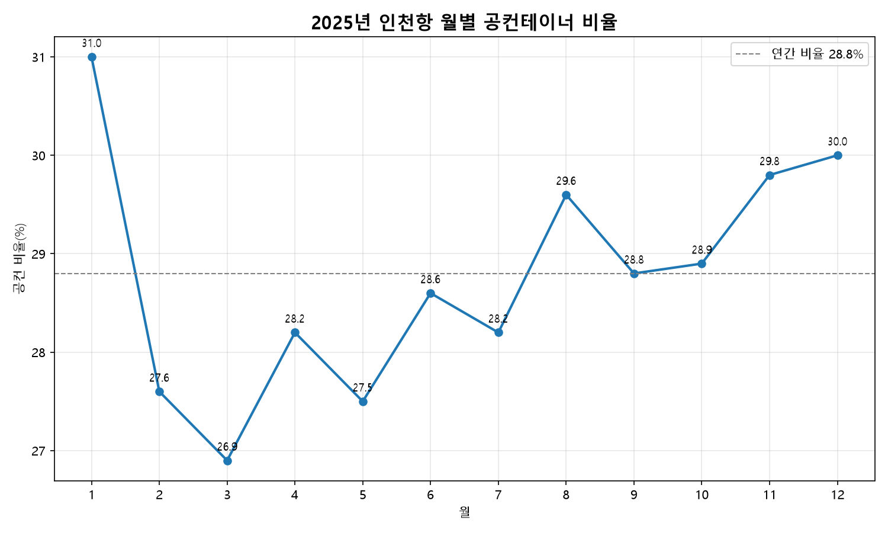

# 보고서 #02 — 인천항 컨테이너의 28.8%는 빈 컨테이너: 재배치 부담의 정량 검증

> [보고서 #01](report_01_공컨테이너_물동량.md)에서 세운 "공컨 비중이 높다 = 수출입 불균형" 가설을, 전체 컨테이너 대비 비율로 실제 검증했다.

- **작성일**: 2026-07-09
- **분석 대상**: 2025년 1~12월 인천항 전체 컨테이너 대비 공(빈)컨테이너 비율
- **한 줄 결론**: 인천항 컨테이너의 약 **28.8%가 빈 컨테이너** — 수입 초과·빈 컨테이너 재배치 부담 구조를 정량으로 확인

---

## 1. 핵심 요약

- 2025년 인천항 전체 컨테이너(적컨+공컨) 대비 **공컨 비율은 연간 28.8%**다. 오간 컨테이너 10개 중 약 3개가 화물 없는 빈 컨테이너였다는 뜻이다.
- 월별로는 **26.9%(3월)~31.0%(1월)** 범위에서 움직이며, **연초·연말에 높고 봄철에 낮은** 완만한 패턴을 보인다.
- #01에서 제기한 "높은 공컨 비중 = 수출입 불균형·재배치 부담" 가설이, 전체 물동량을 분모로 놓고 보아도 **연중 28~30%대로 일관되게 유지**됨을 확인했다. 일시적 현상이 아니라 인천항의 구조적 특성이다.

## 2. 분석 결과



<sub>출처: (분자) 공공데이터포털 인천항만공사 공컨테이너 화물 통계 API / (분모) 인천지방해양수산청 「인천항 물동량」 월별 공표자료. 분모는 천TEU 단위 반올림 공표치.</sub>

### 월별 공컨 비율 (단위: TEU, %)

비율 = 공컨 ÷ 전체 × 100. 분모가 천TEU 반올림 공표치라 **소수 첫째자리까지만** 신뢰한다.

| 월 | 공컨(빈) | 전체(적+공) | 공컨 비율 |
|---:|---:|---:|---:|
| 1월 | 90,346 | 291,000 | **31.0%** |
| 2월 | 62,115 | 225,000 | 27.6% |
| 3월 | 76,912 | 286,000 | **26.9%** |
| 4월 | 87,064 | 309,000 | 28.2% |
| 5월 | 82,606 | 300,000 | 27.5% |
| 6월 | 77,708 | 272,000 | 28.6% |
| 7월 | 79,036 | 280,000 | 28.2% |
| 8월 | 89,759 | 303,000 | 29.6% |
| 9월 | 84,169 | 292,000 | 28.8% |
| 10월 | 80,690 | 279,000 | 28.9% |
| 11월 | 90,284 | 303,000 | 29.8% |
| 12월 | 90,479 | 302,000 | 30.0% |
| **연간** | **991,170** | **3,444,000** | **28.8%** |

<sub>연간 분모는 인천지방해양수산청 12월 공식 누계 3,444천TEU를 사용했다(월별 반올림값의 단순 합 3,442천과 +2천 차이는 천TEU 반올림 오차).</sub>

## 3. 해석

> 아래 해석은 이번 데이터 범위 안에서의 추론이며, 단정이 아니라 설명 가설로 제시한다.

### 3-1. "약 29%가 빈 컨테이너" — 재배치 부담의 실증

#01은 공컨 물동량의 절대 규모(991,170 TEU)와 외국적 편중(88.2%)까지만 보였고, "전체 중 얼마나 되는가"는 열린 질문으로 남겨 두었다. 이번에 전체 컨테이너를 분모로 놓자 그 비중이 **연간 28.8%**로 확정됐다. 컨테이너 10개 중 약 3개가 화물을 싣지 않은 채 항만을 드나든 셈이다. 화물 없이 장비만 이동하는 빈 컨테이너 재배치(empty repositioning)는 선사·항만에 순수 비용으로 작용하므로, 28.8%라는 수치는 #01에서 가설로만 제시했던 '재배치 부담'이 실제로 무시할 수 없는 규모임을 뒷받침한다.

### 3-2. 연중 28~30%대 유지 — 구조적 특성

월별 비율이 26.9%~31.0%의 좁은 띠 안에서만 움직인다는 점이 중요하다. 특정 달에 튀는 예외적 현상이 아니라, **연중 거의 일정하게 3할 안팎을 유지**한다는 것은 이 불균형이 경기나 계절의 산물이 아니라 인천항이 놓인 교역 구조(수도권 배후·근해 수입 관문) 자체에서 비롯됨을 시사한다. #01에서 본 외국적 선사 편중(연중 85~91%)과 같은 결의 '구조적 상수'로 읽을 수 있다.

### 3-3. 연초·연말 고점, 봄철 저점

완만하지만 1월(31.0%)·11~12월(29.8~30.0%)이 높고 3월(26.9%)·5월(27.5%)이 낮은 패턴이 관찰된다. 연말·연초는 수입 성수기 이후 비워진 컨테이너가 반출을 기다리며 쌓이는 시기와, 봄철은 수출 물량이 상대적으로 살아나 적컨 비중이 늘어나는 흐름과 각각 부합하는 방향이다. 다만 폭이 크지 않아(약 4%p) 강한 결론보다는 참고 신호로 둔다.

## 4. 방법론 — 분모를 어떻게 확보했나 (이 보고서의 핵심 난제)

이번 분석의 어려움은 분석 자체가 아니라 **분모(인천항 월별 전체 컨테이너 TEU) 확보**에 있었다. 분자(공컨)는 #01의 API로 이미 있었지만, "인천항의 월별 전체 컨테이너 물동량"을 직접 주는 공공 API는 존재하지 않았다.

- **API 후보 6종을 직접 호출·검증한 뒤 전부 부적합 판정**했다. (전체화물은 톤수 단위, 수출입 API는 항만 구분 없이 교역상대국별 집계, 컨테이너 운영 API는 건단위 원자료로 월 집계 미제공 등) — 상세 근거는 [`docs/API_탐색결과.md`](../docs/API_탐색결과.md)에 기록.
- API로 불가능함을 확인한 뒤, **인천지방해양수산청이 매월 공표하는 「인천항 물동량」 공식 통계 원문(hwpx 12개월치)** 에서 월별 전체 컨테이너(적컨+공컨) TEU를 직접 추출해 분모로 확정했다. 이 공표치는 "적·공 모두 포함"이 명시돼 있어, 기존 공컨 데이터를 이중 계산하지 않고 그대로 분모로 쓸 수 있었다.

즉 **"API가 없으면 공식 통계 원문으로 보완한다"** 는 방향 전환이 이 보고서의 방법론적 핵심이다. 추정치를 만들지 않고 공표된 실측값만 사용했다.

## 5. 한계 및 후속 과제

- **정밀도 한계**: 분모가 천TEU 단위 반올림 공표치라, 비율은 **소수 첫째자리까지만** 신뢰한다. 그 이상 자리는 반올림 오차에 묻히므로 표기하지 않았다.
- **분모 출처의 이원화**: 분자는 API(정밀값), 분모는 공표 통계(반올림값)로 계열이 달라 미세한 정합성 한계가 있다. 향후 SP-IDC 등에서 정밀 전체 TEU가 확보되면 소수 둘째자리까지 정밀화할 여지가 있다.
- **후속 과제**: 적컨(= 전체 − 공컨)의 수출/수입 방향 분해 → 공컨의 방향은 [보고서 #03](report_03_공컨테이너_수출입방향.md)이 규명했고, 적컨의 방향은 전체 컨테이너의 방향별 공표값에서 공컨을 빼는 방식으로 복원해 [보고서 #05](report_05_컨테이너_수지.md)가 규명했다(적컨은 수입 우위 — 당초 '방향 축 부재로 불가'로 본 판정을 정정한다). 2024년 등 타 연도와의 비교로 28.8%가 추세적으로 오르는지/내리는지 확인.

---

## 부록: 데이터 및 재현

### 사용 데이터

| 구분 | 출처 | 특성 |
|------|------|------|
| 분자(공컨) | 공공데이터포털 — 인천항만공사 공컨테이너 화물 통계 API | 월별 TEU, 정밀값 |
| 분모(전체) | 인천지방해양수산청 「인천항 물동량」 월별 공표(2025.01~12) | 적컨+공컨, 천TEU 반올림 |

### 사용 기술

- Python / pandas(비율 계산·병합) / matplotlib(시각화) / zipfile·정규식(hwpx 공표 원문 파싱)

### 재현 방법

```
cd analysis
python calc_ratio.py    # 연간·월별 비율 계산 + ../reports/images/ratio_chart_2025.png 저장
```

- 분자 데이터: `analysis/container_2025.csv` (#01에서 생성)
- 분모 데이터: `analysis/container_total_2025.csv` (공표 원문에서 추출)

### 개발 참고

분모 확보 과정의 API 검증 스크립트 작성과 공표 원문 파싱에 AI 도구(Claude Code)를 활용했다. 다만 **API 6종을 부적합으로 판정하고 공식 통계로 방향을 전환한 판단, 이중 계산 여부(적·공 포함 확인)를 검증한 판단, 결과 해석은 직접 수행했다.**
