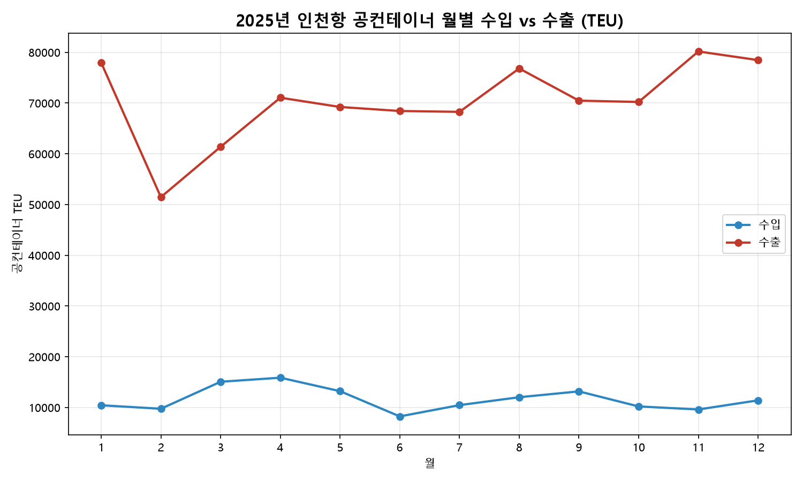
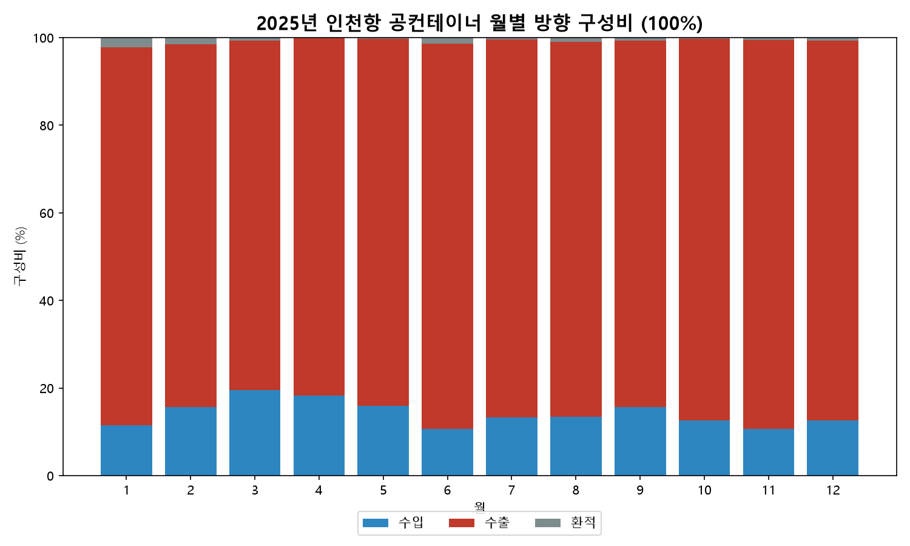

# 보고서 #03 — 인천항 빈 컨테이너의 85.1%는 수출 방향: 불균형의 방향 규명

> [보고서 #01](report_01_공컨테이너_물동량.md)이 "공컨 비중이 높다"는 관찰을, [보고서 #02](report_02_공컨테이너_비율.md)가 "전체의 28.8%"라는 비율로 검증했다. 그럼에도 남은 마지막 질문 — **그 빈 컨테이너는 어느 방향으로 움직이는가** — 을, 이번에는 공식 방향 축(GInOut, 수출입구분)으로 닫는다.

- **작성일**: 2026-07-11
- **분석 대상**: 2025년 1~12월 인천항 공(빈)컨테이너의 수출입 방향별(GInOut) 물동량
- **한 줄 결론**: 빈 컨테이너의 **85.1%가 수출(나가는) 방향**으로, 수입 방향의 **6.1배** — #01·#02가 가설로 세운 '수입 초과·재배치 부담' 구조의 **방향을 정량으로 확정**했다.

---

## 1. 핵심 요약

- 2025년 인천항 공컨테이너는 **수출 방향 843,838 TEU(85.1%)** 대 **수입 방향 139,418 TEU(14.1%)** 로, 배율 **6.1배**다. 환적(수입환적+수출환적)은 7,914 TEU(**0.8%**)로 미미하다.
- 월별 배율은 **4.1배(3월)~8.3배(6월)** 사이에서 움직이며, **연중 단 한 달도 4배 아래로 내려가지 않는다.** 특정 달의 예외가 아니라 구조적 불균형이다.
- **#01(공컨 규모 관찰) → #02(28.8% 비율 검증) → #03(방향 규명)** 으로 이어진 가설 체인이 이 보고서로 완결된다. "빈 컨테이너가 많다"에서 시작해 "그것이 어느 방향으로 쏠려 있는가"까지 답했다.

## 2. 분석 결과



<sub>환적은 연 0.8%로 규모가 작아 표시를 생략했다.</sub>



<sub>출처: 공공데이터포털 — 인천항만공사 공컨테이너 화물 통계 API. 방향 코드(GInOut)의 정의는 공식 활용가이드 기준으로 확정했다 — [docs/GInOut_코드규명.md](../docs/GInOut_코드규명.md) 참고.</sub>

### 표 1. 연간 방향별 물동량 (4분류, 단위: TEU)

| 구분           |               TEU |             비중 |
| -------------- | ----------------: | ---------------: |
| 수입           |           139,418 |            14.1% |
| **수출** | **843,838** |  **85.1%** |
| 수입환적       |             5,029 |             0.5% |
| 수출환적       |             2,885 |             0.3% |
| **합계** | **991,170** | **100.0%** |

### 표 2. 월별 방향별 물동량 (단위: TEU)

|             월 |              수입 |              수출 |       환적(3+4) |              합계 |       수출 비중 |
| -------------: | ----------------: | ----------------: | --------------: | ----------------: | --------------: |
|            1월 |            10,433 |            77,961 |           1,952 |            90,346 |           86.3% |
|            2월 |             9,745 |            51,454 |             916 |            62,115 |           82.8% |
|            3월 |            15,066 |            61,366 |             480 |            76,912 |           79.8% |
|            4월 |            15,865 |            71,049 |             151 |            87,064 |           81.6% |
|            5월 |            13,211 |            69,219 |             176 |            82,606 |           83.8% |
|            6월 |             8,239 |            68,428 |           1,042 |            77,709 |           88.1% |
|            7월 |            10,460 |            68,259 |             318 |            79,037 |           86.4% |
|            8월 |            12,018 |            76,812 |             930 |            89,759 |           85.6% |
|            9월 |            13,170 |            70,465 |             534 |            84,169 |           83.7% |
|           10월 |            10,202 |            70,210 |             279 |            80,691 |           87.0% |
|           11월 |             9,607 |            80,163 |             514 |            90,284 |           88.8% |
|           12월 |            11,403 |            78,454 |             622 |            90,479 |           86.7% |
| **연간** | **139,418** | **843,838** | **7,914** | **991,170** | **85.1%** |

<sub>원자료는 0.25 TEU 단위 소수를 포함하며 표는 정수 반올림했다. 반올림으로 행·열 합이 표기 합계와 최대 2 TEU 차이 날 수 있다.</sub>

## 3. 해석

> 아래 해석은 이번 데이터 범위 안에서의 추론이며, 단정이 아니라 설명 가설로 제시한다.

### 3-1. '어느 방향인가'가 닫혔다

컨테이너는 들어올 땐 화물을 담은 찬 박스로, 나갈 땐 비운 박스로 움직인다. #01·#02는 "인천항은 수입이 많아 빈 컨테이너가 쌓이고, 이를 다시 실어 내보내는 재배치 부담이 있다"는 가설을 세웠지만, 정작 그 **빈 컨테이너가 어느 방향으로 쏠리는지**는 열린 채였다. 이번에 공식 방향 축(GInOut)으로 분해하자, 빈 컨테이너의 **85.1%가 수출 방향(나가는 쪽)** 임이 확정됐다. 빈 박스가 압도적으로 밖으로 나간다는 것은, 그 반대편에서 화물을 실은 컨테이너가 압도적으로 **들어왔다**는 뜻이다 — 즉 적(積)컨테이너는 수입 우위라는, 공컨 흐름의 **거울상**으로 읽는 것이 자연스럽다. 다만 적컨의 방향 수치 자체는 공개 통계 축에 존재하지 않으므로([`docs/03_주제검증.md`](../docs/03_주제검증.md)), 이는 데이터로 직접 잰 값이 아니라 명시적 추론임을 밝혀 둔다. 보강 신호로, 인천지방해양수산청 월별 공표문의 서술형 코멘트("중국 수입, 공컨 수출" 등)도 정성적으로 같은 방향을 가리킨다(출처: 「인천항 물동량」 월별 공표자료).

### 3-2. 연중 한 달도 4배 밑으로 내려가지 않는다 — 구조적 상수

월별 수출÷수입 배율은 **4.1배(3월)에서 8.3배(6월)** 사이, 수출 비중으로는 **79.8%(3월)~88.8%(11월)** 의 높은 띠 안에서만 움직인다. 어떤 달에도 수출 방향 편중이 4배 아래로 풀리지 않는다는 점이 핵심이다. 이는 #02에서 확인한 "공컨 비율이 연중 28~30%대로 일관 유지"와 같은 결의 논거로, 방향 불균형 역시 경기나 계절의 산물이 아니라 인천항의 교역 구조에서 비롯된 **구조적 상수**임을 시사한다.

### 3-3. 계절성의 방향

#01에서 관찰한 2월 저점(전월 대비 −31.2%)은 **수출 방향이 주도**했다. 2월에 수출 공컨은 77,961→51,454 TEU로 **−34.0%** 급감한 반면 수입 공컨은 10,433→9,745로 **−6.6%** 감소에 그쳤다. 연말 고점인 11·12월(수출 80,163·78,454 TEU로 연중 1·2위) 역시 수출 방향이 끌어올렸다. 반대로 3~4월에는 수입 공컨이 상대적으로 늘어(15,066·15,865 TEU, 연 월평균 11,618 대비 높음) 배율이 연중 저점을 찍었다 — 다만 폭이 크지 않아 강한 결론보다는 참고 신호로 둔다.

## 4. 방법론 — 계산이 아니라 '축의 정체 규명'이 난제였다

이번 보고서의 어려움은 계산이 아니라 **분석 축이 무엇인지를 밝히는 일**에 있었다.

1. **후속 과제의 방향 전환.** #02가 남긴 과제는 '적컨의 방향 분해'였으나, 검증 결과 공개 데이터에는 적컨을 수출입 방향으로 나눈 축이 존재하지 않아 **불가 판정**했다([`docs/03_주제검증.md`](../docs/03_주제검증.md)). 그래서 적컨 대신 **공컨 자체의 방향을 분해**하는 우회로로 같은 질문(방향 불균형)에 답했다.
2. **라벨 없는 코드의 [확정].** API의 `GInOut`은 값만 1~4로 오는 라벨 없는 코드였고, 포털의 구 상세페이지 문서는 접근 불가 상태였다. 실데이터 지문 판독(검산 일치·값 분포·필드명)으로 뜻을 좁힌 뒤, **웨이백 머신으로 복원한 공식 활용가이드**로 `1=수입·2=수출·3=수입환적·4=수출환적`, `ocCt 1=수출입항·2=연안항`을 **[확정]** 했다([`docs/GInOut_코드규명.md`](../docs/GInOut_코드규명.md)).
3. **검증 게이트 위에서만 분해.** 원시 재수집 후 다섯 관문을 모두 통과한 뒤에만 집계했다 — 연안항(`ocCt=2`) 전 행이 0임을 확인, 수출입항(`ocCt=1`) 월합 12개가 기존 발행 수치(`container_2025.csv`)와 **소수점까지 일치**, 연간 총합 991,170 일치, 1~3월 GInOut별 회귀 검산 일치. #01·#02의 수치와 완전히 정합한다.

## 5. 한계 및 후속 과제

- **적컨 방향은 추론에 머문다.** 3-1의 "적컨은 수입 우위"는 공컨 흐름의 거울상이라는 명시적 추론이며, 적컨을 방향으로 나눈 직접 데이터가 공개 축에 없어 정밀 검증은 후속 과제로 남는다.
- **환적 세부 기준.** 수입환적·수출환적의 세부 집계 기준은 공식 활용가이드의 코드 정의 수준까지만 확보했다(연 0.8%로 규모 자체는 미미).
- **후속 과제**: ① 2024 vs 2025 **연도 비교**(배율·비중이 추세적으로 오르는지 확인, API 조회 검증 완료) ② **규격별(10/20/40ft) 구성** 분해(원시 데이터에 이미 수록) ③ hwpx 기반 **터미널별(신항/남항/국제여객부두)** 분석.
- **후속(#04)**: 2022~2025 4개년으로 확장해 지속성을 확인했다. 월별 배율의 바닥은 4개년 기준 3.9배(2023년 12월)로 정밀화된다. → [보고서 #04](report_04_공컨테이너_연도별추세.md)

---

## 부록: 데이터 및 재현

### 사용 데이터

| 구분        | 출처                                                    | 특성                       |
| ----------- | ------------------------------------------------------- | -------------------------- |
| 공컨 방향별 | 공공데이터포털 — 인천항만공사 공컨테이너 화물 통계 API | 월별·GInOut별 TEU, 정밀값 |

- #02와 달리 **분모가 필요 없다.** 방향 구성비는 공컨 API 한 종의 내부 분해만으로 산출된다.

### 사용 기술

- Python / requests(API 호출) / pandas(피벗·집계) / matplotlib(시각화) / `xml.etree.ElementTree`(XML 파싱)

### 재현 방법

```
cd analysis
python analyze_direction.py
```

- 한 번 실행으로 **원시 재수집·저장(`container_2025_direction.csv`) → 검증 게이트 5종 → 방향 집계 → 차트 2매** 가 일괄 수행된다. 게이트가 하나라도 실패하면 집계로 진행하지 않고 즉시 종료한다.
- 원시 데이터: `analysis/container_2025_direction.csv` (규격별 8필드 포함, 가공 없이 원시 그대로 보존)

### 개발 참고

스크립트 작성에 AI 도구(Claude Code)를 활용했다. 다만 **방향 코드(GInOut)의 정의를 규명하고, 검증 게이트를 설계하고, 어떤 데이터를 쓸지 판단하고, 결과를 해석하는 일은 직접 수행했다.**
