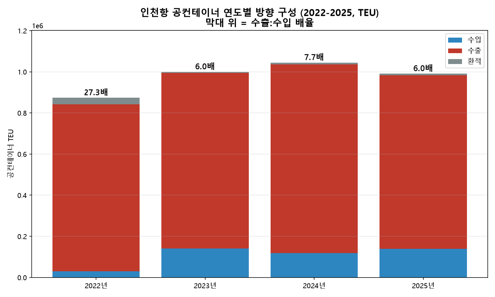
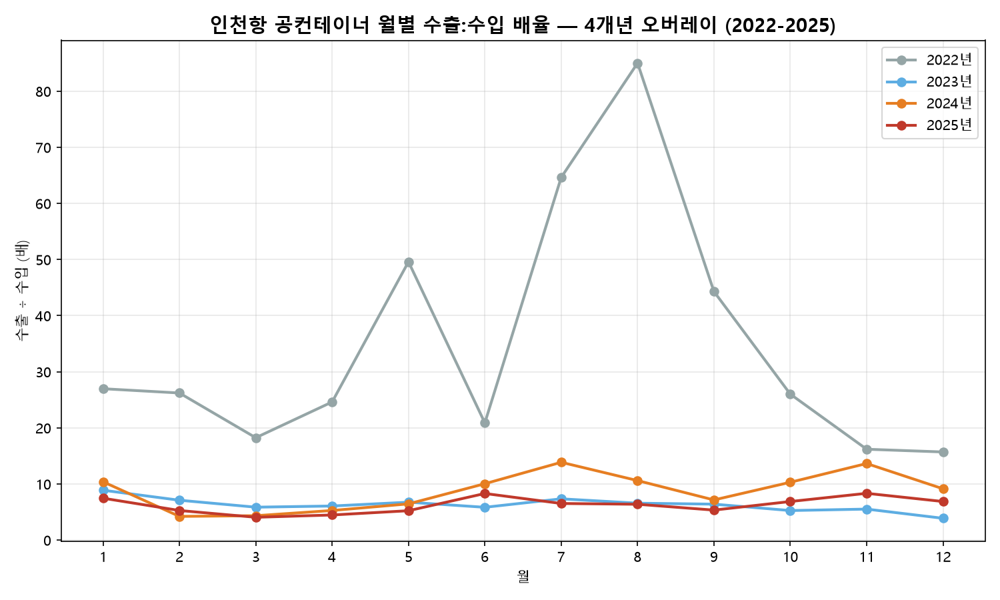

# #04 인천항 공컨테이너 불균형의 지속성 — 연도별 추세 (2022–2025)

> [보고서 #01](report_01_공컨테이너_물동량.md)이 공컨 규모를 관찰하고, [보고서 #02](report_02_공컨테이너_비율.md)가 전체의 28.8%라는 비율로 검증하고, [보고서 #03](report_03_공컨테이너_수출입방향.md)이 그 빈 컨테이너가 **수출 방향으로 6.1배 쏠린다**는 방향을 규명했다. 남은 반론은 하나였다 — **그것이 2025년만의 현상인가.** 이번에는 같은 축(GInOut)을 **2022~2025년 4개년**으로 넓혀, 그 불균형이 한 해의 사건인지 여러 해의 구조인지를 닫는다.

- **작성일**: 2026-07-13
- **분석 대상**: 2022~2025년 4개년(48개월) 인천항 공(빈)컨테이너의 연도별·월별 방향 구성(GInOut), 모집단 ocCt=1(수출입항)
- **한 줄 결론**: 48개월 **전부**에서 공컨은 수출 방향이 수입 방향을 앞섰다(월별 최소 **3.9배**, 연간 **6.0~27.3배**) — 수출 편중은 특정 연도의 사건이 아니라 인천항의 **구조**이며, 최근 3년은 심화가 아니라 안정화 국면이다.

---

## 1. 핵심 요약

1. 2022년 1월부터 2025년 12월까지 48개월 전부에서 공컨테이너는 수출 방향이 수입 방향을 앞섰다. 월별 배율 최소 3.9배(2023년 12월), 연간 배율 6.0~27.3배. #03이 규명한 2025년의 수출 편중(6.1배)은 그 해의 현상이 아니라 여러 해에 걸친 구조다.
2. 다만 크기는 두 국면으로 나뉜다. 2022년은 수입 방향 공컨이 연 29,731 TEU로 극소였고(연간 27.3배, 월별 15.7~85.0배, 환적 비중 3.6%), 2023년부터는 수입 방향이 연 약 12만~14만 TEU 규모로 자리 잡아 연간 배율 6.0~7.7배 대역이 3년째 유지되고 있다.
3. 2025년(6.05배)은 이 대역의 하단이다. 총량·방향 구성 모두 2023년과 거의 같다(총량 −0.9%, 수출 구성 85.3%→85.1%). 최근 3년 기준으로 불균형은 심화가 아니라 안정화 국면이다.
4. #01이 2025년 한 해에서 관찰한 2월 저점은 다개년 패턴으로 확인된다. 4개년 모두 2월 전월 대비 감소(−10.8%~−38.4%), 그중 3개년은 2월이 연중 최저(예외: 2024년, 연중 최저는 11월). 다만 낙폭은 명절 날짜와 기계적으로 일치하지 않아, 이 시리즈는 "연초 명절 시기와 겹치는 반복 저점"까지만 서술한다.

## 2. 분석 결과



<sub>막대 위 숫자는 수출:수입 배율(소수 둘째 자리). 출처: 공공데이터포털 — 인천항만공사 공컨테이너 화물 통계 API(15157693). 방향 코드(GInOut) 정의는 [docs/GInOut_코드규명.md](../docs/GInOut_코드규명.md) 참고.</sub>

### 표 1. 연도별 방향 요약 (단위: TEU, 모집단 ocCt=1)

|   연도 |          총량 |        수출 |        수입 |       환적 | 수출 비중 | 수입 비중 | 환적 비중 | 수출:수입 배율 | 외국적 비중 |
| -----: | ------------: | ----------: | ----------: | ---------: | --------: | --------: | --------: | -------------: | ----------: |
|   2022 |       873,918 |     812,399 |      29,731 |     31,787 |     93.0% |      3.4% |      3.6% |     27.32배 |       87.4% |
|   2023 |       999,990 |     853,212 |     141,451 |      5,328 |     85.3% |     14.1% |      0.5% |      6.03배 |       84.1% |
|   2024 |     1,044,970 |     916,976 |     119,022 |      8,972 |     87.8% |     11.4% |      0.9% |      7.70배 |       89.0% |
|   2025 |       991,170 |     843,838 |     139,418 |      7,914 |     85.1% |     14.1% |      0.8% |      6.05배 |       88.2% |

<sub>TEU는 정수 반올림 표기이며 원자료는 0.25 TEU 단위 소수를 포함한다(예: 2025 수출 843,837.75 → 843,838). 배율은 소수 둘째 자리까지 표기했다.</sub>

<sub>방향별 수치와 총량은 각각 원자료 소수(0.25 TEU 단위)를 반올림한 값으로, 방향별 합이 총량과 ±1 TEU 차이 날 수 있다(2022·2023년 행 해당).</sub>



<sub>수출 방향(GInOut=2) ÷ 수입 방향(GInOut=1), 외국적+한국적 합, ocCt=1 기준.</sub>

### 표 2. 월별 수출:수입 배율 (12개월 × 4개년)

|    월 |  2022 | 2023 | 2024 | 2025 |
| ----: | ----: | ---: | ---: | ---: |
|    1월 | 26.98 | 8.89 | 10.40 | 7.47 |
|    2월 | 26.22 | 7.11 |  4.23 | 5.28 |
|    3월 | 18.25 | 5.87 |  4.35 | 4.07 |
|    4월 | 24.62 | 6.08 |  5.28 | 4.48 |
|    5월 | 49.60 | 6.76 |  6.46 | 5.24 |
|    6월 | 20.89 | 5.85 | 10.05 | 8.31 |
|    7월 | 64.64 | 7.36 | 13.87 | 6.53 |
|    8월 | 85.01 | 6.58 | 10.61 | 6.39 |
|    9월 | 44.31 | 6.41 |  7.16 | 5.35 |
|   10월 | 26.02 | 5.27 | 10.31 | 6.88 |
|   11월 | 16.20 | 5.53 | 13.65 | 8.34 |
|   12월 | 15.71 | 3.89 |  9.15 | 6.88 |
| **연간** | **27.32** | **6.03** | **7.70** | **6.05** |

### 표 3. 연도별 2월 저점 — 전월 대비 증감과 연중 최저 월

|   연도 | 2월 전월 대비 | 연중 최저 월 |
| -----: | ------------: | -----------: |
|   2022 |       −38.4% |        2월 |
|   2023 |       −19.0% |        2월 |
|   2024 |       −10.8% |       11월 |
|   2025 |       −31.2% |        2월 |

## 3. 해석

> 아래 해석은 이번 데이터 범위 안에서의 추론이며, 단정이 아니라 설명 가설로 제시한다.

① 방향은 한 번도 뒤집히지 않았다. 48개월 중 수입 방향이 수출 방향을 앞선 달은 없고, 가장 균형에 가까웠던 달조차 3.9배(2023년 12월)였다. #03은 2025년 데이터로 "연중 한 달도 4배 아래로 내려가지 않는다"고 썼는데, 4개년으로 넓히면 바닥은 3.9배로 소폭 내려간다 — 표현은 정밀해졌고 결론은 강화됐다. 인천항 공컨테이너의 수출 방향 편중은 특정 연도의 사건이 아니라 이 항만의 구조다.

② 다만 크기는 한 번 크게 움직였다. 2022년 수입 방향 공컨은 연 29,731 TEU로, 이후 연도의 약 1/4~1/5 수준이다. 빈 컨테이너가 인천으로 거의 들어오지 않던 해였고, 배율은 월 최대 85배까지 치솟았다. 2023년부터 수입 방향이 연 12만~14만 TEU로 올라서며 배율 대역이 6.0~7.7배로 내려앉았고, 이 새 균형이 3년째 유지되고 있다. 이 전환의 원인 규명(글로벌 컨테이너 수급·운임 사이클 등)은 본 데이터의 범위 밖이므로 여기서는 관측만 기록한다.

③ 2024년은 대역 안의 상단 특이점이다. 수출 방향 최대(916,976 TEU), 수입 방향은 오히려 축소(119,022 TEU), 배율 7.70배. 같은 해 인천항 전체 컨테이너 물동량도 2025년보다 많았다(인천지방해양수산청 공표 원문 기준, 2024년 3,558천TEU vs 2025년 3,444천TEU). 전체 물동량이 늘어난 해에 빈 컨테이너를 내보내는 압력도 커졌다는 그림은 적컨테이너 수입 우위라는 거울상 추론(#03)과 정합적이지만, 적컨의 방향별 직접 데이터는 여전히 없으므로 이는 명시적 추론이다.

④ 2월 저점은 패턴으로 승격하되, 서술은 조심스럽게 한다. 4개년 모두 2월에 전월 대비 감소했고 3개년은 연중 최저였다. 그러나 낙폭은 명절 날짜와 기계적으로 일치하지 않는다 — 설이 1월 말이던 2025년의 낙폭(−31.2%)이 설이 2월 중순이던 2024년(−10.8%)보다 컸고, 2024년은 연중 최저가 11월이었다. 따라서 "연초 명절 시기와 겹치는 저점의 반복"까지만 말하고, 낙폭의 결정 요인은 열어 둔다.

⑤ 이로써 #01(관찰) → #02(검증) → #03(규명) → #04(지속성)의 연구 체인이 닫힌다. 다음 질문은 "이 재배치 부담을 어느 부두가 지는가"다.

## 4. 방법론

이번 보고서는 새 축을 규명하는 대신, #03이 확정한 방향 축(GInOut)을 다개년으로 넓혀 **기대값의 유효 범위를 다시 세우는 일**이 핵심이었다.

- **데이터원·수집 사양**: 공공데이터포털 공컨 API(15157693). 4개년(2022·2023·2024·2025) 각 1회 호출, `searchStartM="01"` **0패딩 필수** — 미준수 시 정상 응답(resultCode=00)에 부분 결과만 반환되는 오탐 사례가 있었다([docs/04_주제검증.md](../docs/04_주제검증.md) §3 정정 참조). 전 필드를 가공 없이 원시 보존한다.
- **모집단 정의**: ocCt=1(수출입항). #01~#03과 동일하게, 배제 근거는 규모가 아니라 정의다. 연안(ocCt=2)은 부록에서 별도 관측으로 기록한다.
- **검증 게이트 요약**: G1 연도별 ocCt=1 48행·스키마 동일 / G2 모집단 확인 / G3 재수집분이 기존 정본과 **행 단위 완전 일치** + 소수 앵커(2025 총 991,170.0 / 수출 843,837.75 / 수입 139,418.25 / 환적 7,914.0, 2024 총 1,044,969.5) 정확 일치 / G4 규격 환산식 전 행 잔차 0·월별 대역·방향 0 부재. 외부 대조값이 없는 2022·2023은 내적 지문(행수·환산식·방향합 일치)으로 검증했다.
- **표기 규칙**: 발행 수치는 정수 반올림 표기이며, 원자료 합은 0.25 TEU 단위 소수를 포함한다(예: 2025 수출 843,837.75 → 843,838). 배율은 소수 둘째 자리까지 표기했다. #03의 '6.1배'는 동일 값(6.05)의 소수 첫째 자리 표기다.
- **전체 컨테이너 연간값**은 hwpx 원문 인쇄값을 사용했다(2024년: '24년 연간' 열 3,558천TEU, 2025년: 12월 누계 열 3,444천TEU — #02의 연간 분모와 동일 값). 월별 인쇄값의 단순 합과는 각 값의 독립 반올림으로 소폭 차이가 날 수 있다(2024년 1천TEU, 2025년 2천TEU. #02 각주와 동일 취지).

## 5. 한계 및 후속 과제

1. 2022·2023년 수치는 시리즈 내 기존 발행 수치나 외부 공표 대조값이 없어, 내적 정합 검증(행수·규격 환산식·방향합 일치)만 통과했다. 인천항만공사가 매년 발간하는 「인천항 주요통계」 통계집에 공컨테이너 구분이 있는지 확인해 대조하는 것을 후속 과제로 둔다.
2. 2022년 이례 국면(수입 방향 극소·환적 비중 상이)의 원인 규명은 본 데이터 범위 밖이다.
3. 적컨테이너의 방향별 직접 데이터는 없다. 거울상 서술은 명시적 추론이다.
4. 계절성 서술은 4개 관측점에 근거하며 낙폭 변동이 크다. "연초 명절 시기와 겹치는 반복 저점" 이상을 주장하지 않는다.

- **후속 보고서 1순위 후보**: 부두별 구성(신항/남항/국제여객부두, [docs/04_주제검증.md](../docs/04_주제검증.md) §4 이월).

---

## 부록: 데이터 및 재현

### 사용 데이터

| 구분        | 출처                                                     | 특성                          |
| ----------- | -------------------------------------------------------- | ----------------------------- |
| 공컨 방향별 | 공공데이터포털 — 인천항만공사 공컨테이너 화물 통계 API(15157693) | 연·월·GInOut별 TEU, 정밀값 |

### 표 A1. 월별 총량 (단위: TEU, 모집단 ocCt=1)

|    월 |   2022 |   2023 |   2024 |   2025 |
| ----: | -----: | -----: | -----: | -----: |
|    1월 | 88,225 | 81,424 | 95,040 | 90,346 |
|    2월 | 54,385 | 65,965 | 84,758 | 62,115 |
|    3월 | 66,166 | 82,891 | 85,283 | 76,912 |
|    4월 | 58,377 | 82,810 | 89,229 | 87,064 |
|    5월 | 75,874 | 79,191 | 87,931 | 82,606 |
|    6월 | 71,098 | 80,405 | 85,404 | 77,708 |
|    7월 | 88,252 | 81,615 | 86,054 | 79,036 |
|    8월 | 81,692 | 80,480 | 88,620 | 89,759 |
|    9월 | 68,509 | 89,385 | 82,284 | 84,169 |
|   10월 | 76,737 | 87,089 | 84,426 | 80,690 |
|   11월 | 72,150 | 92,179 | 81,231 | 90,284 |
|   12월 | 72,453 | 96,556 | 94,710 | 90,479 |

### 연안(ocCt=2) 관측

2022·2023년에 한국적 연안 공컨 실적이 소량 존재한다(연 689.5 / 199.5 TEU, ocCt=1 대비 0.08% 이하). 2024년부터 0이다. 원인(실제 소멸 vs 집계 관행 변화)은 본 자료로 판별 불가([docs/GInOut_코드규명.md](../docs/GInOut_코드규명.md) §9 참조).

### 사용 기술

- Python / requests(API 호출) / pandas(피벗·집계) / matplotlib(시각화) / `xml.etree.ElementTree`(XML 파싱)

### 재현 방법

```
cd analysis
python analyze_direction_multiyear.py
```

- 저장된 원시 CSV 4종(`container_2022/2023/2024_direction.csv`, `probe/recheck_2025_raw.csv`)을 입력으로, 검증 게이트 G1~G4 → 연도별 방향 집계 → 차트 2매가 일괄 수행된다. 게이트가 하나라도 실패하면 집계로 진행하지 않고 즉시 종료한다.
- 규격 필드·`_10` 관련 정정 내역은 [docs/GInOut_코드규명.md](../docs/GInOut_코드규명.md) 참조.

### 개발 참고

스크립트 작성과 디버깅에 AI 도구(Claude Code)를 활용했다. 다만 **어떤 데이터를 쓸지 선정하고, 검증 게이트의 기대값을 확정하고, 예상 밖 결과(연안 실적·`_10` 정정)를 판단하고, 결과를 해석하는 일은 직접 수행했다.**
