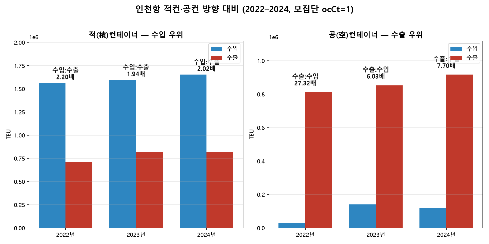
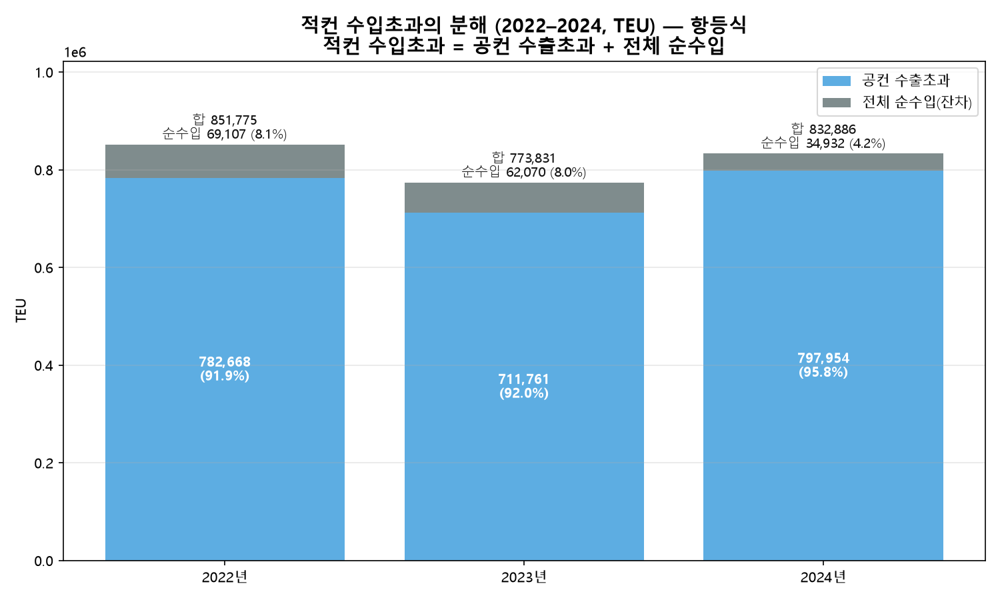

# #05 인천항 컨테이너 수지 — 적컨은 수입, 공컨은 수출 (2022–2024)

> [보고서 #01](report_01_공컨테이너_물동량.md)이 공컨의 규모를, [#02](report_02_공컨테이너_비율.md)가 전체의 28.8%라는 비율을, [#03](report_03_공컨테이너_수출입방향.md)이 그 빈 컨테이너가 수출로 6.1배 쏠린다는 방향을, [#04](report_04_공컨테이너_연도별추세.md)가 그 쏠림이 48개월 내내 지속됨을 밝혔다. 남은 질문은 **왜**다. 전체 컨테이너에서 공컨을 빼면 적(積)컨테이너가 남는다 — 그 방향을 보면 공컨이 수출로 쏠리는 그림의 나머지 절반이 드러난다.

- **작성일**: 2026-07-15
- **분석 대상**: 2022·2023·2024년 인천항 전체 컨테이너의 방향별(수입/수출/환적) 공표값과 공(빈)컨테이너 방향별(API)의 차로 복원한 적(積)컨테이너 방향 구성. 모집단 ocCt=1(수출입항). 2025년은 방향별 공식 미공개로 총량만 표기.
- **한 줄 결론**: 전체 컨테이너는 방향이 균형(수입:수출 1.02~1.05배)이지만, 공컨을 빼면 적컨은 수입으로 쏠린다(2.20/1.94/2.02배) — 공컨의 수출 쏠림과 정반대 방향이다. 다만 3개년 관찰이므로 인천항의 구조라고 단정하지 않는다.

---

## 1. 핵심 요약

전체 수출입 컨테이너를 비교하면 수입과 수출이 균형을 이룬다. 어느 한쪽이 특출나게 많거나 적지 않으며, 2022년 1.05배, 2023년 1.04배, 2024년 1.02배라는 수치가 이를 보여준다. 그러나 적컨과 공컨으로 구분하면 이야기가 다르다. 적컨은 수입으로, 공컨은 수출로 방향이 쏠린다. 적컨의 수입:수출은 2022년 2.20배, 2023년 1.94배, 2024년 2.02배로 세 해 모두 수입이 수출의 두 배 안팎이다. 공컨은 반대 방향으로 더 극단적이어서, 수출:수입이 2022년 27.32배, 2023년 6.03배, 2024년 7.70배에 이른다. 다만 이는 3개년치 데이터를 분석한 결과로서, 위와 같은 형태를 인천항의 구조라고 단정 짓기는 어렵다.

## 2. 분석 결과

왼쪽 적(積)컨테이너는 수입 방향이, 오른쪽 공(空)컨테이너는 수출 방향이 앞선다. 모집단 ocCt=1(수출입항). 공컨 방향은 공공데이터포털 — 인천항만공사 공컨테이너 화물 통계 API(15157693), 전체 방향은 표 1 출처 참조.

### 표 1. 전체 컨테이너 방향별 (공표값, 단위: TEU)

|   연도 |        수입 |        수출 |       환적 | 출처 |
| -----: | ----------: | ----------: | ---------: | --- |
|   2022 |   1,593,012 |   1,523,905 |     71,789 | 인천지방해양수산청 「인천항 컨테이너 물동량」 연도별 표 |
|   2023 |   1,737,244 |   1,675,174 |     47,581 | 인천항만공사 2023년 실적발표(2024-01-24) |
|   2024 |   1,772,061 |   1,737,129 |     49,265 | 인천항만공사 2024년 실적발표(2025-02-02) |

연도별 소스가 다르다 — 각주 1 참조. 2025년은 전체 방향별이 공식 미공개이며, 총합계 3,443,849.5 TEU만 확정된다.

### 표 2. 적컨 복원(전체 − 공컨)과 방향 배율 (단위: TEU)

|   연도 |   적컨 수입 |   적컨 수출 | 적컨 수입:수출 | 공컨 수출:수입 | (참고) 전체 수입:수출 |
| -----: | ----------: | ----------: | -------------: | -------------: | --------------------: |
|   2022 |   1,563,281 |     711,506 |     **2.20배** |        27.32배 |                1.05배 |
|   2023 |   1,595,793 |     821,963 |     **1.94배** |         6.03배 |                1.04배 |
|   2024 |   1,653,039 |     820,153 |     **2.02배** |         7.70배 |                1.02배 |

적컨 = 전체 방향별(표 1) − 공컨 방향별(API), 각 방향(수입·수출)에서. TEU는 정수 반올림 표기이며 원자료는 0.25 TEU 단위 소수를 포함한다(예: 적컨 수입 2022 = 1,563,280.75 → 1,563,281). 배율은 소수 둘째 자리까지 표기했다. 공컨 수출:수입 배율은 #03·#04와 동일 값이다.

적컨 수입초과 = 공컨 수출초과 + 전체 순수입. 이 관계는 정의상 항상 성립하는 항등식이다 — 각주 2 참조.

### 표 3. 적컨 수입초과의 분해 (단위: TEU)

|   연도 | 적컨 수입초과 |     공컨 수출초과 | 전체 순수입(잔차) | 순수입 비중 |
| -----: | ------------: | ----------------: | ----------------: | ----------: |
|   2022 |       851,775 |   782,668 (91.9%) |            69,107 | 8.1% (외항의 2.17%) |
|   2023 |       773,831 |   711,761 (92.0%) |            62,070 | 8.0% (외항의 1.79%) |
|   2024 |       832,886 |   797,954 (95.8%) |            34,932 | 4.2% (외항의 0.98%) |

'적컨 수입초과 = 공컨 수출초과 + 전체 순수입'은 항등식이다(각주 2). 초과분의 분해로만 표기하며, 두 흐름 사이의 인과·목적을 뜻하지 않는다.

## 3. 해석

> 아래 해석은 이번 데이터 범위 안에서의 관찰이며, 단정이 아니라 설명으로 제시한다.

전체 수출입 컨테이너에서 수입 대 수출은 1.0배 근처로 균형을 이루지만, 공컨을 제외하면 적컨은 수입이 수출의 2배 안팎으로 나타난다. 전체만 봤으면 놓쳤을 방향이다. 또한 공컨 배율은 해마다 크게 요동쳤지만 적컨의 수입 우위는 3개년 모두 2배 안팎을 유지했다. 배경과 환경이 바뀌어도 적컨 수입 우위는 크게 흔들리지 않았다는 뜻이다. 마지막으로 적컨의 수입초과는 공컨의 수출초과와 전체 순수입의 합과 같다. 이 등식은 `적컨 = 전체 − 공컨`의 정의에서 곧바로 따라 나오는 항등식이며, 데이터에서도 이 등식이 정확히 성립함(잔차 0)을 확인했다. 즉 적컨의 수입초과는 공컨의 수출초과와 전체 순수입으로 분해된다. 다만 잔차인 전체 순수입에는 장치장 재고 변동·육상 반출입·소스 간 집계 기준차 등이 가설로 가능하나, 이 데이터로는 어느 것인지 가릴 수 없다.

## 4. 방법론

이번 보고서는 새 축을 규명하는 대신, #03·#04가 확정한 공컨의 방향을 전체 컨테이너의 방향과 대조하기 위해, 공표되지 않은 적컨의 방향을 `적컨 = 전체 − 공컨`으로 복원하는 것이 핵심이었다.

- **데이터원**: (1) 전체 컨테이너 방향별 — 공표 통계 3종(표 1: 2022 인천지방해양수산청 연도별 표 / 2023·2024 인천항만공사 연초 실적발표). (2) 공(빈)컨테이너 방향별 — 공공데이터포털 공컨 API(15157693), 모집단 ocCt=1(수출입항), (forEmpTeu + korEmpTeu)를 방향(GInOut)별 집계. 방향 코드 정의는 [docs/GInOut_코드규명.md](../docs/GInOut_코드규명.md) 참조.
- **복원 방법**: 각 방향에서 적컨 = 전체 − 공컨(수입·수출·환적). 두 데이터원의 모집단이 대응하는지 검증한 뒤 뺐다 — 공컨 ocCt=2(연안항) ≤ 공표 연안, 적컨이 전 방향 양수임을 확인(모집단 정합·부호). 주제 검증 전 과정은 [docs/05_주제검증.md](../docs/05_주제검증.md).
- **검증 게이트**: 적컨 복원값(공컨계·적컨 수입·적컨 수출·배율)을 사전 확정한 기대값과 대조하고(불일치 시 정지), 초과분 분해 항등식이 수치적으로 닫히는지(허용오차 0.01 TEU) 확인했다. 계산은 챗 두뇌 실행 + 클로드 코드 로컬 재실행으로 이중 확인했다.
- **표기 규칙**: 발행 수치는 정수 반올림 표기이며, 원자료 합은 0.25 TEU 단위 소수를 포함한다(예: 적컨 수입 2022 = 1,563,280.75 → 1,563,281). 배율은 소수 둘째 자리까지 표기했다.
- **상쇄율을 쓰지 않은 이유**: '적컨 수입초과 = 공컨 수출초과 + 전체 순수입'은 정의상 항상 성립하는 항등식이므로(각주 2), 공컨 수출초과의 비중(91.9~95.8%)은 데이터로 검증되는 명제가 아니다. 따라서 이를 '상쇄율'이나 '검산'으로 서술하지 않고 초과분의 분해로만 표기했다.
- **용어 규칙**: '적컨/공컨'은 공표 통계 용어(적(積)/공(空)컨테이너)를 따른다. '수지'는 관찰된 산술 관계를 가리키며 경영적 의사결정을 뜻하지 않는다. 두 흐름의 방향이 반대라는 사실을 함께 관찰한 것까지가 이 보고서의 범위이며, 한쪽이 다른 쪽을 위해 발생했다는 인과는 본 데이터로 증명되지 않는다.

## 5. 한계 및 후속 과제

1. **2025년 방향 분석 제외**: 2025년 전체 컨테이너의 방향별 값은 공식 미공개다(감소한 해로, 인천항만공사 연초 실적발표에 수입/수출 분리가 없고, 해양수산부 통계는 만TEU 단위 수출입 합산 340만뿐). 따라서 방향 분석은 2022·2023·2024 3개년이며, 2025년은 총합계 3,443,849.5 TEU만 표기한다.
2. **선커밋 기준 이탈 기록**: 주제 검증의 선커밋 기준은 2025년을 포함한 4개년 확보를 요구했다. 명제(적컨 수입:수출 ≥ 1.5배)는 확보 3개년 전부에서 성립하였으나, 2025년 방향별이 공식 발표되지 않아 4개년 요건에 미달했다. 기준 원문을 사후 수정하지 않고 확보 3개년으로 채택한다(이탈 기록은 [docs/05_주제검증.md](../docs/05_주제검증.md) §4).
3. **초과분 분해의 잔차**: 「전체 순수입」(2022년 69,107 TEU, 외항의 2.17% 등)에는 장치장 재고 변동·육상 반출입·소스 간 집계 기준차 등 여러 가설이 가능하나 본 데이터로는 판별 불가하다. 인천항의 컨테이너는 육상·타 항만으로도 이동하므로 단일 항만의 수지가 닫혀야 할 물리적 이유는 없다.
4. **소스 이질성**: 전체 컨테이너의 총량이 소스마다 미세하게 다르다(각주 1). 어느 소스가 옳다고 단정하지 않고 관측만 기록한다.
5. **2025년 확보 시 승격**: 인천항만공사 PRESS ROOM 연초 실적발표 또는 해운항만물류정보시스템(SP-IDC)에서 2025년 방향별을 확보하면 4개년 완전 분석으로 갱신한다.

- **후속 보고서 후보**: 부두별 구성(신항/남항/국제여객부두)은 공컨 × 부두 교차표가 공개 데이터에 없어 유보 상태다([docs/05_주제검증.md](../docs/05_주제검증.md) §0).

---

## 부록: 데이터 및 재현

### 사용 데이터

| 구분        | 출처                                                     | 특성                          |
| ----------- | -------------------------------------------------------- | ----------------------------- |
| 전체 방향별 | 인천지방해양수산청 연도별 표(2022) · 인천항만공사 연초 실적발표(2023·2024) | 수입/수출/환적, TEU 정수 |
| 공컨 방향별 | 공공데이터포털 — 인천항만공사 공컨테이너 화물 통계 API(15157693) | 연·월·GInOut별 TEU, 모집단 ocCt=1 |

### 사용 기술

- Python / pandas(복원·집계) / matplotlib(시각화). 이종 데이터 결합 검증(적컨 = 전체 − 공컨), 항등식 규명, 검증 게이트(기대값 대조·항등식 닫힘).

### 재현 방법

    cd analysis
    python chart_05_balance.py

- 전체 방향별(total_container_direction.csv)과 공컨 원시(container_2022/2023/2024_direction.csv)를 입력으로, 대조 게이트(공컨계·적컨수입·적컨수출·배율·항등식) → 차트 2매가 일괄 수행된다. 게이트가 하나라도 불일치하면 차트를 만들지 않고 즉시 종료한다. 적컨 복원 표는 calc_jeok.py로도 재현된다.

### 개발 참고

계산·차트 스크립트 작성에 AI 도구(Claude Code)를 활용했다. 다만 **어떤 데이터를 쓸지 선정하고, 두 데이터원의 결합 가능성을 검증하고, 검증 항목과 항등식의 성격을 판단하고, 결과를 해석하는 일은 직접 수행했다.**

---

**각주**

1. 전체 컨테이너 방향별 분모는 연도별로 소스가 다르다 — 2022 인천지방해양수산청 연도별 표, 2023·2024 인천항만공사 연초 실적발표. 세 소스의 '전체 컨테이너' 총량이 미세하게 다르며(집계 정의 차이로 추정), 어느 소스가 옳다고 단정하지 않는다.
2. '적컨 수입초과 = 공컨 수출초과 + 전체 순수입'은 `적컨 = 전체 − 공컨`의 정의에서 곧바로 따라 나오는 항등식이며, 데이터로 검증되는 명제가 아니다. 초과분의 분해로만 표기하고 검산으로 해석하지 않는다.
