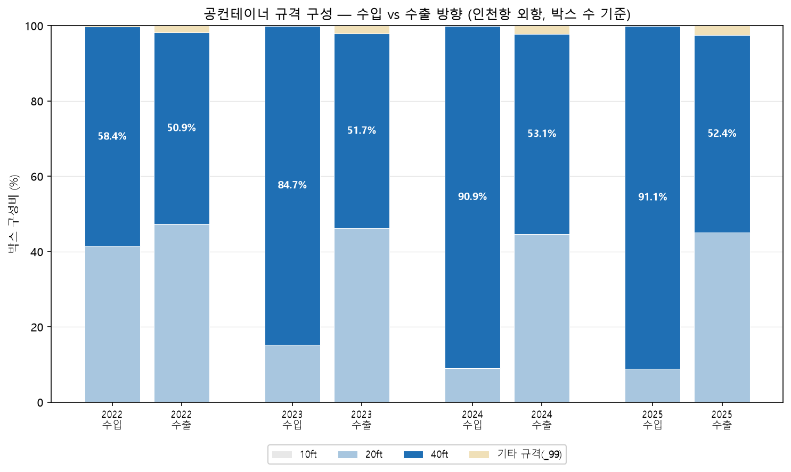
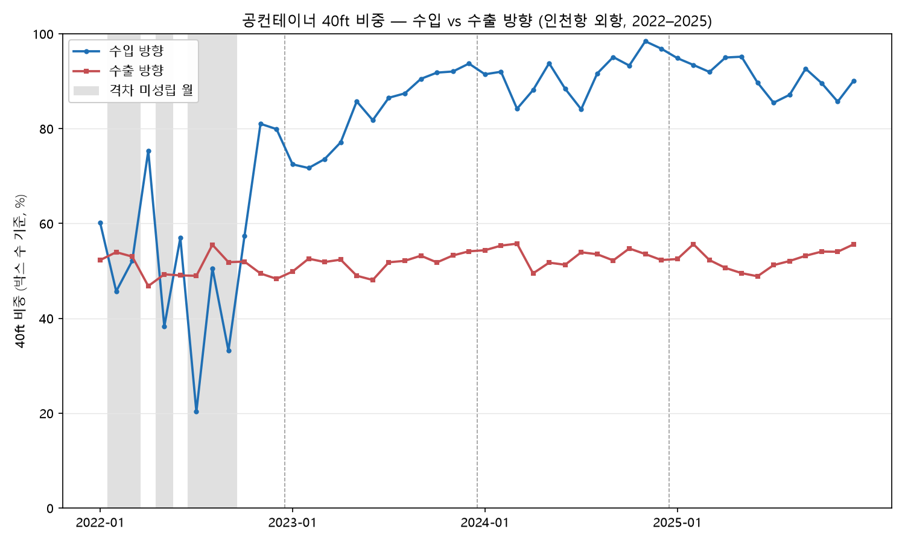

# #06 공컨테이너 규격×방향 비대칭 — 수입 공컨은 40ft로 쏠린다 (2022–2025)

> [보고서 #01](report_01_공컨테이너_물동량.md)이 공컨의 규모를, [#02](report_02_공컨테이너_비율.md)가 전체의 28.8%라는 비율을, [#03](report_03_공컨테이너_수출입방향.md)이 수출로 6.1배 쏠린다는 방향을, [#04](report_04_공컨테이너_연도별추세.md)가 그 쏠림의 48개월 지속을, [#05](report_05_컨테이너_수지.md)가 적컨과의 거울상을 밝혔다. 다섯 편은 전부 '얼마나, 어느 방향으로'라는 물량(TEU) 축이었다. 이번에는 축을 하나 연다 — **어떤 크기의 상자가** 움직이는가. 같은 빈 컨테이너라도 수입 방향과 수출 방향의 규격 구성이 다른가, 다르다면 그 비대칭은 48개월 내내 지속되는가.

---

## 1. 핵심 요약

【회장님 직접 작성 — 발행 세션. 재료: 수입 40ft 비중 58.4%→91.1% 심화 vs 수출 50.9~53.1% 안정, 연도 격차 +7.5→+38.7%p, 월 단위 42/48 성립, 미성립 6개월 전부 2022년, 2022-10부터 39개월 연속 성립】

## 2. 분석 결과

10ft는 4개년 전 방향 합계 5박스로 차트에서 식별되지 않는다(각주 3). '기타 규격(_99)'의 구체 규격은 확인되지 않았다(각주 2).

### 표 1. 연도×방향 규격 구성 (외항, 단위: 박스)

| 연도 | 방향 | 10ft | 20ft | 40ft | 기타(_99) | 총 박스 | 40ft 비중 |
|---|---|---:|---:|---:|---:|---:|---:|
| 2022 | 수입 | 0 | 7,739 | 10,932 | 57 | 18,728 | 58.4% |
| 2022 | 수출 | 1 | 251,181 | 269,981 | 9,447 | 530,610 | 50.9% |
| 2023 | 수입 | 0 | 11,665 | 64,804 | 79 | 76,548 | 84.7% |
| 2023 | 수출 | 3 | 255,602 | 285,844 | 11,520 | 552,969 | 51.7% |
| 2024 | 수입 | 0 | 5,616 | 56,676 | 24 | 62,316 | 90.9% |
| 2024 | 수출 | 0 | 262,673 | 312,630 | 12,908 | 588,211 | 53.1% |
| 2025 | 수입 | 1 | 6,431 | 66,463 | 27 | 72,922 | 91.1% |
| 2025 | 수출 | 0 | 244,457 | 284,468 | 13,531 | 542,456 | 52.4% |

박스 수는 원자료 정수값 그대로이며, 비중은 박스 수 기준 소수 1자리다(각주 1). TEU 기준은 40ft=2TEU 가중이 내재되어 규격 비중 측정에 쓰지 않는다(§4).

연도별 격차(수입 40ft 비중 − 수출 40ft 비중): **+7.5%p(2022) → +33.0%p(2023) → +37.8%p(2024) → +38.7%p(2025)**.

회색 음영 = 격차가 0 이하인 월(6개월, 전부 2022년). 2022-08은 수입 613박스의 저볼륨 월이다(각주 4). 48개월 전체 수치는 부록 A 참조.

### 표 2. 선커밋 판정 (기준 원문: docs/06_주제검증.md §4)

| 항목 | 기준 (선커밋) | 결과 | 판정 |
|---|---|---|---|
| V1-2025 (연도) | 2025년 수입 40ft 비중 ≥ 수출 40ft 비중 + 5%p | 91.1% vs 52.4% (+38.7%p) | **통과** |
| V2 (월 단위) | 48개월 중 39개월 이상에서 (수입 40ft% − 수출 40ft%) > 0 | 42/48 성립 | **통과** |

→ **완전 채택(4개년 48개월).** 미성립 6개월(2022-02·03·05·07·08·09)은 전부 2022년이며, 2022-10부터 2025-12까지 39개월 연속 성립했다. 2022~2024 연도 결과는 선커밋 이전에 이미 관측했으므로 '검증 통과'가 아니라 주제 실재성 근거로만 쓴다 — 검증은 미관측 영역(V1-2025·V2)에서만 성립한다(§4).

## 3. 해석

> 아래 해석은 이번 데이터 범위 안에서의 관찰이며, 단정이 아니라 설명으로 제시한다.

【회장님 직접 작성 — 발행 세션. 규칙: 인과·목적 단정 금지("선사가 ~하려고" 류), 가설은 가설임을 명시. 다룰 수 있는 관찰 재료: ① 수입 방향 40ft 편중 심화(58.4→84.7→90.9→91.1%) ② 수출 방향 구성 안정(50.9~53.1%) ③ 2022→2023 경계가 #04의 두 국면 경계와 겹침(교차 정합 관측) ④ 수입 방향 공컨은 수출의 약 1/7 규모라 월 단위 변동성이 큼】

## 4. 방법론

- **데이터·모집단**: 공컨테이너 화물 통계 API 원시 CSV 4개년(`analysis/container_2022~2025_direction.csv`). 모집단은 외항(ocCt=1), 외국적+한국적 합산. 단일 소스로 완결되며 이질 소스 결합이 없다.
- **방향 축**: 수입(GInOut=1) vs 수출(GInOut=2). 환적(GInOut=3·4)은 방향별 연 2,352~16,175 TEU로 규모가 작고, 단독 분석 후보로는 유보 판정되어(docs/06_주제검증.md §1) 이번 비교에서 제외했다.
- **규격 비중은 박스 수로만 계산한다**: 40ft 비중 = `_40 / (_10+_20+_40+_99)`. TEU는 규격 가중(40ft=2TEU)이 정의에 내재되어 있어, TEU로 규격 비중을 재면 순환 논증이 된다. 물량 비교 문장에만 TEU를 병기한다.
- **규격식 검산**: `0.5×_10 + 1×_20 + 2×_40 + 2.25×_99 = TEU`가 외항 전 행(4개년 192행 × 외국적·한국적 = 384건)에서 최대편차 0으로 성립함을 확인했다.
- **파서**: 헤더명 기준으로 작성했다. 2025년 CSV는 2022~2024와 컬럼 순서가 다르고 `esbCntcDt` 필드가 없어, 위치 인덱스 파싱은 오류를 낳는다.
- **검증 게이트(회귀 앵커)**: 연간 공컨 원자료 소수값(873,917.5 / 999,990.25 / 1,044,969.5 / 991,170.0)과 수출/수입 배율(27.32 / 6.03 / 7.70 / 6.05)이 기발행 #01·#04 값을 재현하는지, 3개년 박스 앵커(수입 157,592 / 수출 1,671,790, 40ft 84.0% / 51.9%)가 주제검증 프로브를 재현하는지 대조했다. 게이트가 하나라도 불일치하면 집계·차트를 만들지 않고 즉시 종료한다.
- **선커밋과 사전 관측 고지**: 판정 기준(V1-2025·V2, 저볼륨 규칙 포함)은 결과를 집계하기 전에 docs/06_주제검증.md로 먼저 커밋했다. 2022~2024 연도 관측은 선커밋 이전 실행분이므로 실재성 근거로 강등해 고지했고, 2025년은 선커밋 시점에 커버리지(행 존재)만 확인하고 집계를 의도적으로 유예했다.
- **저볼륨 규칙**: 분모 0인 월은 미성립으로 센다(보수 처리, 해당 없음 — 분모 0 월 0개). 월 1,000박스 미만은 각주로 표시하되 V2 판정에서 제외하지 않는다.
- **층간 재현**: 계산 결과를 두 실행 환경(챗 컨테이너 / 로컬)에서 독립 수행해 전 항목 일치를 확인했다(스크립트 내 X-CHECK 대조 게이트).

## 5. 한계 및 후속 과제

1. **`_99`의 정의 미확인**: API 응답의 잔여 규격 필드로, '기타 규격'으로만 서술한다(각주 2). 수출 방향에서 1.8~2.5% 수준으로 존재한다.
2. **공컨 한정**: 이 데이터는 공컨테이너만 담는다. 적컨·전체 컨테이너의 규격×방향 구성은 이 소스로 알 수 없다.
3. **환적 제외**: 규모 극소·유보 판정으로 제외했다(§4). 환적을 포함한 규격 구성은 다루지 않는다.
4. **2022년의 월 단위 혼조**: 연도 기준 격차는 +7.5%p로 성립하나 월 단위로는 12개월 중 6개월이 미성립이다. 수입 방향 월 물량이 613~2,398박스로 작아 월별 비중의 변동성이 크다 — 월 단위 판정의 저볼륨 감도는 이 보고서의 구조적 한계다.
5. **관측 서술의 한계**: 이 보고서는 규격 구성의 비대칭과 그 지속을 관측할 뿐, 왜 그런지(선사 운영·화물 구조 등)는 데이터 밖이다.
- **후속 과제**: 부두별 분해(hwpx 공표 4개년 축적 시 재검토), 방향별 계절성(진폭) — docs/06_주제검증.md §1 후보 ③·④.

## 부록 A. 월별 판정 표 (48개월, 박스 수 기준)

| 연월 | 수입 박스 | 수입 40ft% | 수출 박스 | 수출 40ft% | 격차(%p) | 성립 |
|---|---:|---:|---:|---:|---:|:---:|
| 2022-01 | 1,932 | 60.1 | 54,321 | 52.3 | +7.9 | O |
| 2022-02 | 1,315 | 45.7 | 32,340 | 54.0 | −8.3 | X |
| 2022-03 | 2,041 | 52.1 | 37,065 | 53.0 | −0.9 | X |
| 2022-04 | 1,233 | 75.3 | 35,797 | 46.8 | +28.5 | O |
| 2022-05 | 1,024 | 38.3 | 46,203 | 49.3 | −11.0 | X |
| 2022-06 | 1,976 | 57.0 | 42,841 | 49.1 | +7.9 | O |
| 2022-07 | 1,049 | 20.3 | 53,922 | 49.0 | −28.7 | X |
| 2022-08† | 613 | 50.6 | 49,824 | 55.5 | −4.9 | X |
| 2022-09 | 1,118 | 33.2 | 42,835 | 51.8 | −18.7 | X |
| 2022-10 | 1,758 | 57.3 | 46,625 | 52.0 | +5.4 | O |
| 2022-11 | 2,271 | 81.0 | 43,748 | 49.5 | +31.6 | O |
| 2022-12 | 2,398 | 79.9 | 45,089 | 48.3 | +31.6 | O |
| 2023-01 | 4,697 | 72.5 | 47,464 | 49.9 | +22.6 | O |
| 2023-02 | 4,731 | 71.7 | 37,387 | 52.6 | +19.1 | O |
| 2023-03 | 6,950 | 73.6 | 45,718 | 51.9 | +21.7 | O |
| 2023-04 | 6,593 | 77.1 | 45,878 | 52.4 | +24.7 | O |
| 2023-05 | 5,494 | 85.7 | 45,441 | 49.0 | +36.8 | O |
| 2023-06 | 6,457 | 81.8 | 45,533 | 48.1 | +33.7 | O |
| 2023-07 | 5,232 | 86.5 | 46,473 | 51.8 | +34.7 | O |
| 2023-08 | 5,651 | 87.4 | 45,120 | 52.1 | +35.3 | O |
| 2023-09 | 6,311 | 90.5 | 49,571 | 53.2 | +37.3 | O |
| 2023-10 | 7,119 | 91.8 | 46,666 | 51.8 | +40.0 | O |
| 2023-11 | 7,270 | 92.0 | 49,547 | 53.3 | +38.8 | O |
| 2023-12 | 10,043 | 93.7 | 48,171 | 54.1 | +39.6 | O |
| 2024-01 | 4,322 | 91.5 | 55,060 | 54.4 | +37.1 | O |
| 2024-02 | 8,422 | 92.0 | 43,671 | 55.3 | +36.7 | O |
| 2024-03 | 8,533 | 84.2 | 43,066 | 55.7 | +28.4 | O |
| 2024-04 | 7,428 | 88.1 | 48,421 | 49.5 | +38.7 | O |
| 2024-05 | 6,025 | 93.8 | 48,755 | 51.7 | +42.0 | O |
| 2024-06 | 4,082 | 88.4 | 50,273 | 51.3 | +37.1 | O |
| 2024-07 | 3,048 | 84.1 | 49,713 | 53.9 | +30.2 | O |
| 2024-08 | 3,978 | 91.6 | 51,811 | 53.5 | +38.1 | O |
| 2024-09 | 5,135 | 95.1 | 46,277 | 52.2 | +42.9 | O |
| 2024-10 | 3,851 | 93.3 | 48,602 | 54.7 | +38.6 | O |
| 2024-11 | 2,789 | 98.4 | 48,182 | 53.6 | +44.9 | O |
| 2024-12 | 4,703 | 96.9 | 54,380 | 52.3 | +44.6 | O |
| 2025-01 | 5,354 | 94.9 | 50,162 | 52.5 | +42.4 | O |
| 2025-02 | 5,038 | 93.4 | 32,626 | 55.6 | +37.8 | O |
| 2025-03 | 7,849 | 91.9 | 39,382 | 52.3 | +39.7 | O |
| 2025-04 | 8,133 | 95.0 | 46,292 | 50.6 | +44.4 | O |
| 2025-05 | 6,769 | 95.2 | 45,440 | 49.5 | +45.6 | O |
| 2025-06 | 4,343 | 89.7 | 44,988 | 48.9 | +40.8 | O |
| 2025-07 | 5,635 | 85.5 | 44,104 | 51.2 | +34.2 | O |
| 2025-08 | 6,420 | 87.1 | 49,587 | 52.1 | +35.0 | O |
| 2025-09 | 6,834 | 92.6 | 45,055 | 53.2 | +39.4 | O |
| 2025-10 | 5,381 | 89.6 | 44,573 | 54.1 | +35.5 | O |
| 2025-11 | 5,171 | 85.7 | 51,009 | 54.0 | +31.6 | O |
| 2025-12 | 5,995 | 90.1 | 49,238 | 55.6 | +34.5 | O |

† 저볼륨 월(각주 4). 격차는 반올림 전 값으로 계산해 소수 1자리로 표기했다 — 표시된 두 비중의 차와 최대 0.1%p 다를 수 있다(각주 1). 소수 4자리 원값은 `analysis/size_direction_monthly.csv` 참조.

## 부록 B. 데이터 및 재현

### 사용 데이터

| 구분        | 출처                                                     | 특성                          |
| ----------- | -------------------------------------------------------- | ----------------------------- |
| 공컨 규격×방향 | 공공데이터포털 — 인천항만공사 공컨테이너 화물 통계 API(15157693) 원시 CSV | 연·월·GInOut·규격(_10/_20/_40/_99) 박스 수 + TEU, 모집단 ocCt=1 |

### 사용 기술

- Python / matplotlib(시각화). 규격식 내적 검산(384건), 기발행 소수 앵커 회귀, 선커밋 대비 판정, 이중 실행 환경 대조(X-CHECK), 헤더명 기준 파싱(연도별 스키마 차이 대응).

### 재현 방법

    cd analysis
    python chart_06_size.py

- 게이트(구조·규격식·소수 앵커·프로브 박스 앵커) → V1-2025·V2 판정 → 월별 판정 표(`size_direction_monthly.csv`) → 차트 2매가 일괄 수행된다. 게이트가 하나라도 불일치하면 집계·차트를 만들지 않고 즉시 종료한다. 판정 기준의 선커밋 원문은 `docs/06_주제검증.md` §4다.

### 개발 참고

계산·차트 스크립트 작성에 AI 도구(Claude Code)를 활용했다. 다만 **판정 기준을 결과 집계 전에 먼저 커밋하고, 규격 비중의 단위(박스 수)를 선택하고, 게이트·저볼륨 규칙을 설계하고, 결과를 해석하는 일은 직접 수행했다.**

---

**각주**

1. 박스 수는 공컨 API 원자료의 정수값 그대로다(4개년 전 규격 필드에서 비정수 0건 확인). 비중·격차는 반올림 전 값으로 계산해 소수 1자리로 표기하며, 표시값끼리의 산술과 최대 0.1%p 차이가 날 수 있다. 본문의 TEU 언급값은 원자료 0.25 TEU 단위 소수의 정수 반올림이다.
2. `_99`는 API 응답의 잔여 규격 필드로, 공식 정의를 확인하지 못했다. '기타 규격'으로만 서술하며 특정 규격(45ft 등)으로 단정하지 않는다. TEU 환산 계수 2.25는 규격식 검산으로 확인될 뿐이다.
3. 10ft(`_10`)는 4개년 48개월, 수입·수출·환적 전 방향 합계 5박스다 — 수입 1박스(2025), 수출 4박스(2022년 1·2023년 3), 환적 0박스.
4. 저볼륨: 2022-08 수입 613박스(월 1,000박스 미만). 선커밋 규칙대로 V2 판정에서 제외하지 않고 미성립으로 집계했다(보수 처리). 그 외 47개월은 양방향 모두 1,000박스 이상이다.
