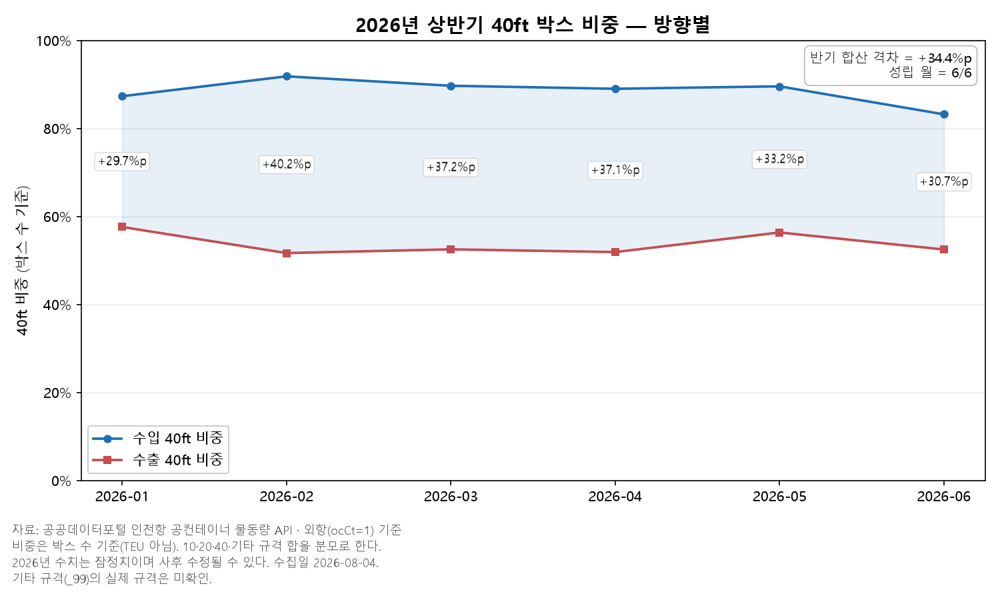
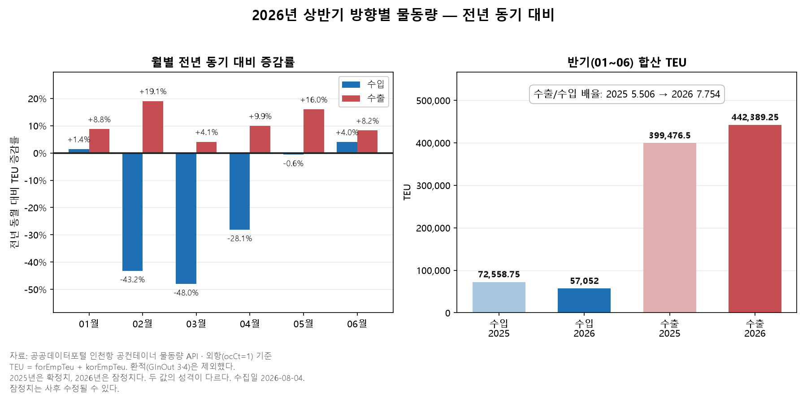

# #07 인천항 공컨테이너 표본외 검증 — 45개월째 깨지지 않았다 (2026년 1~6월)

> [보고서 #01](report_01_공컨테이너_물동량.md)이 공컨의 규모를, [#02](report_02_공컨테이너_비율.md)가 전체의 28.8%라는 비율을, [#03](report_03_공컨테이너_수출입방향.md)이 수출로 6.1배 쏠린다는 방향을, [#04](report_04_공컨테이너_연도별추세.md)가 그 쏠림의 48개월 지속을, [#05](report_05_컨테이너_수지.md)가 적컨과의 거울상을, [#06](report_06_공컨테이너_규격방향.md)이 수입 공컨의 40ft 쏠림을 밝혔다. 여섯 편은 전부 2022~2025년 데이터 위에 서 있다. 이번에는 새 축을 열지 않는다 — **그 여섯 편이 쓰지 않은 데이터에서도 같은 관계가 성립하는가**를 묻는다. 기준을 먼저 걸고, 그다음에 데이터를 받았다.

- **작성일**: 2026-08-25
- **분석 대상**: 2026년 1~6월 인천항 공(빈)컨테이너의 방향(수입/수출)별 TEU와 규격(10/20/40ft·기타)별 박스 수. 모집단 ocCt=1(수출입항), 환적(GInOut 3·4) 제외. 2022~2025년 4개년 분석에서 관측된 패턴에 대한 표본외 검증.
- **한 줄 결론**: 판정 기준 4개를 데이터 수집 전에 커밋하고 그대로 판정했다 — 4개 전부 PASS. 40ft 비중 격차의 부호는 **45개월**째 뒤집히지 않았고, 2026년 상반기 합산 격차는 **+34.4%p**, 6월 수출/수입 배율은 **8.642**로 산출됐다. 기준 무수정·사후조정 0건.

---

## 1. 핵심 요약

- **표본외 4개 기준 전부 PASS.** 2022~2025년 4개년에서 관측된 두 패턴(방향 우위·규격 격차)이, 그 분석에 쓰이지 않은 2026년 상반기 데이터에서도 성립했다. 판정 기준 V1~V4는 데이터를 내려받기 전에 문서로 커밋했고(git blob `c95bbfc8…`), 판정 뒤에도 고치지 않았다.
- **규격 축**: 40ft 박스 비중 격차(수입−수출)가 6개월 전부 양(+)으로 산출돼, 부호 연속 성립 기록이 **45개월**로 늘었다. 상반기 합산 비중은 수입 **88.3%** / 수출 **53.9%**, 격차 **+34.4%p**다(박스 수 기준).
- **방향 축**: 2026-06 단월로 판정했다. 수출 **74,065.75** TEU > 수입 **8,570.25** TEU, 배율 **8.642**로 #04가 관측한 월별 하한 **3.9배**를 웃돌았다. 나머지 다섯 달은 검증 지위에서 강등된 구간이라 판정 대상에서 제외했다(§2.1).
- **2026년 수치는 전 구간 잠정치다.** 사후 수정될 수 있으며, 2025년 확정치와 성격이 같지 않다.

## 2. 분석 결과

### 2.1 검증 설계 — 기준을 먼저 못 박았다

이번 편은 새로운 분석이 아니라 **기존 결론에 대한 표본외 검증**이다.
2022~2025년 4개년 데이터에서 관측된 패턴이, 그 분석에 쓰이지 않은
2026년 상반기 데이터에서도 성립하는지를 확인했다.

핵심은 순서다. **판정 기준 V1~V4를 2026년 데이터를 내려받기 전에 선언**하고
저장소에 커밋했다. 기준 문서는 `docs/07_주제검증.md` §4이며,
해당 시점의 git blob 해시는 `c95bbfc859c67fd7cdddb497eb822eadce4b3544`다.
데이터를 본 뒤 기준을 손질하는 것을 구조적으로 차단하기 위한 장치다.

| 기준 | 판정 대상 | 통과 조건 |
|---|---|---|
| V1 방향 지속 | 2026-06 | 수출 TEU > 수입 TEU |
| V2 배율 하한 | 2026-06 | 수출/수입 배율 ≥ 3.9 |
| V3 격차 부호 | 2026-01~06 월별 | 매월 40ft 비중 격차 > 0 |
| V4 격차 크기 | 2026-01~06 합산 | 격차 ≥ +5.0%p |

V1·V2의 판정 대상이 6월 단독인 데는 이유가 있다. 2026-01~05 구간의
방향·배율 축은 분석 과정에서 발생한 컬럼 오인 사고로 **검증 지위에서 강등**됐고,
그 사실은 기준 확정 전에 `docs/07_주제검증.md` §0 노출 이력 ②에 기록됐다.
규격 축(V3·V4)은 미관측 상태가 유지돼 6개월 전 구간을 검증 대상으로 뒀다.

### 2.2 판정 결과 — V1~V4 전부 PASS

| 기준 | 결과 | 판정 |
|---|---|---|
| V1 방향 지속 | 수출 74,065.75 > 수입 8,570.25 TEU | PASS |
| V2 배율 하한 | 8.642 | PASS |
| V3 격차 부호 | 6/6 성립 | PASS |
| V4 격차 크기 | +34.4%p | PASS |

기준 무수정. 사후조정 0건. 선언한 기준 그대로 판정했다.

### 2.3 V3 상세 — 40ft 박스 비중 격차

| 월 | 수입 40ft 비중 | 수출 40ft 비중 | 격차 |
|---|---|---|---|
| 2026-01 | 87.3% (4,930/5,647) | 57.6% (30,498/52,960) | +29.7%p |
| 2026-02 | 91.8% (2,650/2,886) | 51.7% (20,537/39,755) | +40.2%p |
| 2026-03 | 89.7% (3,701/4,127) | 52.5% (21,597/41,131) | +37.2%p |
| 2026-04 | 89.0% (5,370/6,034) | 51.9% (26,116/50,336) | +37.1%p |
| 2026-05 | 89.5% (6,202/6,926) | 56.3% (28,393/50,398) | +33.2%p |
| 2026-06 | 83.2% (3,889/4,675) | 52.5% (24,938/47,534) | +30.7%p |
| **합산** | **88.3%** (26,742/30,295) | **53.9%** (152,079/282,114) | **+34.4%p** |

비중 산출 기준·분모 정의·반올림 처리는 각주 1.

이 6개월이 전부 성립하면서, 격차 부호 연속 성립 기록은
**2022-10부터 45개월**로 연장됐다.

### 2.4 전년 동기 대비 (참고 통계 — 검증 아님)

| 월 | 수입 2025 → 2026 | 증감 | 수출 2025 → 2026 | 증감 |
|---|---|---|---|---|
| 01 | 10,433.00 → 10,582.00 | +1.4% | 77,961.25 → 84,785.50 | +8.8% |
| 02 | 9,745.00 → 5,536.00 | -43.2% | 51,454.00 → 61,258.25 | +19.1% |
| 03 | 15,066.00 → 7,830.50 | -48.0% | 61,366.25 → 63,879.25 | +4.1% |
| 04 | 15,864.75 → 11,404.00 | -28.1% | 71,048.50 → 78,109.50 | +9.9% |
| 05 | 13,211.00 → 13,129.25 | -0.6% | 69,219.00 → 80,291.00 | +16.0% |
| 06 | 8,239.00 → 8,570.25 | +4.0% | 68,427.50 → 74,065.75 | +8.2% |
| **합** | **72,558.75 → 57,052.00** | **-21.4%** | **399,476.50 → 442,389.25** | **+10.7%** |

반기 수출/수입 배율: **5.506(2025) → 7.754(2026)**.

이 절의 합산값은 강등 구간(2026-01~05)을 포함하므로 검증 대상이 아니다. 해석하지 않는 이유는 §3-3. 이질 비교는 각주 2, 강등 구간 취급은 각주 3.

### 2.5 실행 게이트

판정에 앞서 5개 게이트를 통과시켰다. 계산이 맞았는지가 아니라
**계산에 쓴 데이터가 성립하는지**를 확인하는 단계다.

| 게이트 | 확인 대상 | 결과 |
|---|---|---|
| 1 회귀 앵커 | 기존 연도 값이 동일 코드로 재현되는가 | PASS |
| 2 Teu 항등식 | 규격별 박스 수와 TEU가 맞물리는가 | PASS (최대 잔차 0.0) |
| 3 정수성 | 박스 수 288셀이 전부 정수인가 | PASS |
| 4 월 소실 | 01~06이 빠짐없이 존재하는가 | PASS |
| 5 X-CHECK | 두 계층이 독립 산출한 값이 일치하는가 | PASS (불일치 0건) |

게이트 1은 기존 CSV를 재합산하는 방식이 아니라 **동일 코드 경로로 다시 수집**해
맞췄다. 기존 파일을 재합산하는 것은 그 파일이 옳다는 전제로 그 파일을
검증하는 순환이기 때문이다.

게이트별 상세 값은 `docs/07_판정결과.md`에 있다.

## 3. 해석

> 아래 해석은 이번 데이터 범위 안에서의 관찰이며, 단정이 아니라 설명으로 제시한다.

### 3-1. 45개월이 말하는 것과 말하지 않는 것

**말하는 것.** 40ft 비중 격차의 부호가 45개월 동안 한 번도 뒤집히지 않았다.
이 45개월 중 마지막 6개월은 [#06](report_06_공컨테이너_규격방향.md) 발행 시점에
존재하지 않던 데이터다. 즉 이번 6개월은 기존 결론을 다시 확인한 것이 아니라,
기존 결론이 **닿은 적 없는 구간**에서 같은 부호가 나온 것이다.

**말하지 않는 것.** 이 관계가 앞으로도 성립한다는 것. PASS는 선언한 조건을
충족했다는 뜻이지 법칙의 발견이 아니다. 다음 구간이 미성립일 수 있고,
그 경우에도 기준을 고치지 않고 FAIL로 게시한다.

부호가 유지됐다는 것과 크기가 안정적이라는 것도 다른 말이다.
이번 편이 판정한 것은 부호(V3)와 합산 크기의 하한(V4)이지, 월별 격차의 안정성이 아니다.

### 3-2. 이 편이 앞의 여섯 편에 하는 일

앞 여섯 편은 각자의 데이터 안에서 각자의 결론을 확인했다.
이번 편은 그 결론들을 **그 데이터 밖에 놓았다.**

여기서 통과보다 중요한 것은 순서다. 기준 V1~V4는 2026년 데이터를 받기 전에
커밋됐고, 그 시점의 blob 해시가 남아 있다. 결과를 보고 기준을 손질할 여지가
구조적으로 없었다는 뜻이다. 만약 어느 하나가 미성립이었다면 기준을 고치는 대신
이탈을 기록하고 「구조 변화 신호」로 발행할 설계였다. **그 설계가 먼저 있었다는 것이 PASS의 조건이다.** 기준을 나중에 정할 수 있는
상태였다면 4개 통과는 아무것도 말해주지 않는다.

### 3-3. 이 데이터로 판별할 수 없는 것

**① 원인.** 관측된 것은 값과 값들의 관계까지다. 왜 그런 값이 나왔는지는
이 데이터의 범위 밖이며, 이 보고서는 그 답을 시도하지 않는다.

**② 2026-01~05의 방향·배율.** §2.4의 전년 동기 비교와 반기 합산 배율은
강등 구간을 포함한다. 표로는 남기되 **해석하지 않는다.** 숫자가 계산돼 있다는
것과 그 숫자로 말해도 된다는 것은 다르다. 이 구간에 대해 할 수 있는 정직한
처리는 계산 결과를 공개하고 지위를 밝힌 뒤 결론에 쓰지 않는 것이다.

**③ 잠정치의 한계.** 2026년 값은 전 구간 잠정이며 사후 수정될 수 있다.
2025년 확정치와 나란히 놓았으나 두 값의 성격은 같지 않다.

**④ 기타 규격(_99).** 비중 계산의 분모에 들어가지만 공식 정의를 확인하지
못했다. 추정하지 않고 [미확인]으로 둔다.

## 4. 한계와 후속

### 4.1 한계

**① 2026년 수치는 전 구간 잠정치다.**
사후 수정될 수 있다. 수집일은 2026-08-04이며, 월별 적재일은
01월 2026-02-19 / 02월 2026-03-19 / 03월 2026-04-17 /
04월 2026-05-17 / 05월 2026-06-18 / 06월 2026-07-14이다.
2025년 확정치와 나란히 놓고 비교했으나 두 값의 성격은 같지 않다.

**② 2026-01~05의 방향·배율은 검증이 아니다.**
분석 과정에서 컬럼 오인 사고가 있었고, 해당 구간의 방향 축은
검증 지위에서 강등됐다. 이 사실은 판정 기준을 확정하기 전에
`docs/07_주제검증.md` §0 노출 이력 ②로 기록했다.
V1·V2를 6월 단독으로 판정한 것은 그 기록에 따른 결과다.

**③ 단일 소스다.**
공컨테이너 물동량 API 하나에서만 가져왔다. 다른 기관 통계와의
교차 확인은 하지 않았다.

**④ 기타 규격(_99)의 내용은 미확인이다.**
비중 계산의 분모에 포함되지만, 이 코드가 어떤 규격을 가리키는지
공식 정의를 확인하지 못했다. 추정하지 않고 [미확인]으로 둔다.

**⑤ 이 데이터로는 원인을 알 수 없다.**
관측된 것은 값과 값들의 관계까지다. 왜 그런 값이 나왔는지는
이 데이터의 범위 밖이며, 이 보고서는 그 답을 시도하지 않는다.

**⑥ PASS는 기준 통과이지 법칙이 아니다.**
선언한 조건을 충족했다는 뜻이며, 앞으로도 성립한다는 보장은 아니다.
다음 구간에서 FAIL이 나올 수 있고, 그 경우에도 기준을 고치지 않고
FAIL로 게시한다.

### 4.2 후속

- **검증 연장.** 2026년 하반기 데이터가 적재되면 동일 기준으로 다시 판정한다.
  기준은 이번과 같은 방식으로 데이터 수집 전에 선언한다.
- **교차 소스 확인.** 한계 ③을 푸는 경로로 관세청 항구·공항별 수출입실적을
  후보로 둔다. 같은 항만을 다른 신고 체계로 집계한 소스다.
- **연안항 구간.** 2026-01~06 연안항(ocCt=2) 12행이 전부 0으로 관측됐다 [관측].
  해석은 착수하지 않았다. 별도 주제로 다룰 소재 후보다.
- **2025년 전체 방향별 승격.** 공식 공개 또는 기관 확인이 있을 때만 해제한다.

## 부록 — 재현

| 항목 | 위치 |
|---|---|
| 판정 기준 (사전 선언) | `docs/07_주제검증.md` §4 |
| 판정 결과 전문 | `docs/07_판정결과.md` |
| 수치 정본 대장 | `docs/FACTS.md` |
| 수집 코드 | `analysis/collect_07_2026_direction.py` |
| 판정 코드 | `analysis/judge_07_2026.py` |
| 차트 코드 | `analysis/chart_07_2026.py` |
| 데이터 | `analysis/container_2026_direction.csv` |

## 표기

| 항목 | 내용 |
|---|---|
| **검수·발행** | **운영자** — 발행 전 결론 자리(제목·한 줄 결론·핵심 요약·해석) 통독, 기계가 무작위로 뽑은 수치 1건의 출처 대조, 발행 실행. 검수 기록은 `docs/검수기록.md`에 남는다. 발행물의 책임은 운영자에게 있다. |
| **데이터 출처** | 공공데이터포털 — 인천항만공사 공컨테이너 화물 통계 API (`ipaEmpConCargoInfo`) |
| **재현 코드** | 위 「부록 — 재현」의 스크립트 전부가 이 저장소에 공개돼 있다. 원시 CSV도 함께 있다. |

---

**각주**

1. 비중은 **박스 수 기준**이다(TEU 기준은 40ft에 2배 가중이 들어가 순환 논증이 된다). 분모는 10·20·40·기타 규격 박스 수의 합이며, 분모가 0인 월은 없다. 비중과 격차는 반올림 전 값으로 계산한 뒤 표기 단계에서만 소수 1자리로 잘랐다.
2. 이질 비교 각주: 2025년은 확정치, 2026년은 잠정치다. 두 값의 성격이 다르다.
3. 2026-01~05 구간의 방향·배율은 위 2.1에서 밝힌 대로 검증 지위에서 강등된 구간이며, 여기서는 **참고 통계**로만 인용한다. 결론(제목·요약·해석)에는 쓰지 않는다.
