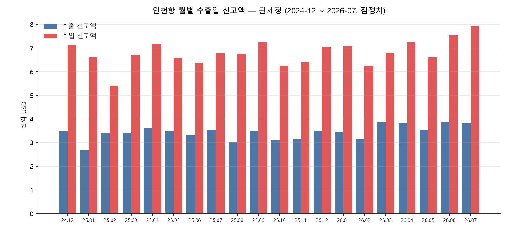
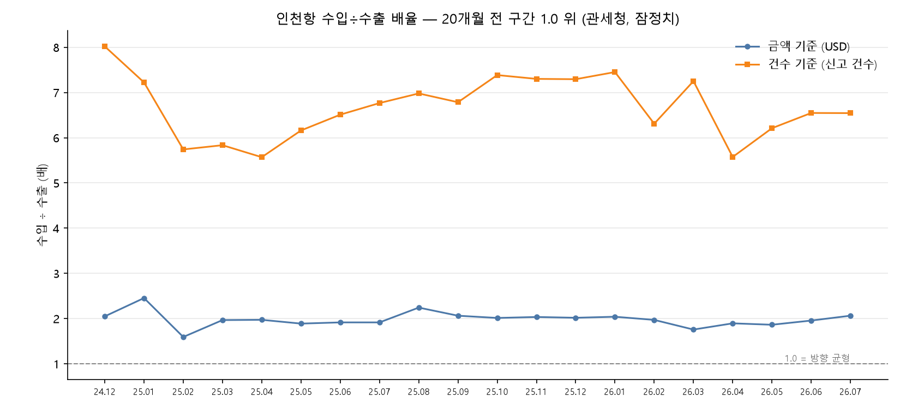

# #08 인천항, 다른 기관 소스로 다시 봤다 — 20개월 전 구간 수입 우위 (2024-12~2026-07)

> [보고서 #05](report_05_컨테이너_수지.md)가 인천항만공사 자료로 **「적컨은 수입, 공컨은 수출」**을 냈고, [#07](report_07_공컨테이너_표본외검증.md)이 그 결론들을 2026년 상반기로 표본외 검증했다. 일곱 편은 전부 **한 소스** 위에 서 있다 — #07 §4.1 한계 ③이 그것을 스스로 적었다. 이번 편은 새 축을 열지 않는다. **다른 기관의 다른 신고 체계**로 같은 항구를 보고, 방향이 같게 나오는지만 묻는다. 기준을 먼저 걸고, 그다음에 데이터를 받았다.

- **작성일**: 2026-08-26
- **분석 대상**: 2024-12~2026-07 인천항(`portCd=KRINC`) 수출입 **신고 건수**와 **신고 금액(USD)**. 출처는 관세청 「항구·공항별 수출입실적」이다. 월별로 신고 세관(`cstmSgn`)을 가로질러 합산했고, 인천국제공항·경인항은 별개 코드라 포함하지 않았다.
- **한 줄 결론**: 판정 기준을 데이터 수집 전에 커밋하고 그대로 판정했다 — 인천항은 금액·건수 **둘 다 수입 우위**로 산출됐고, 그 방향이 **20개월** 창 전 구간에서 유지됐으며 두 기준이 어긋난 달은 **0건**이었다. 값은 맞대지 않고 **부호만** 맞댔다 — 두 소스는 단위·모집단·집계 주체가 전부 다르다.

---

## 1. 핵심 요약

- **선커밋을 지켰다.** 질문 3개·창·모집단·단위·검산을 데이터를 받기 전에 문서로 커밋했다(git blob `df28c251…`). 판정 뒤 그 문서를 한 글자도 고치지 않았다.
- **방향**: 관세청 신고 기준으로 인천항은 **금액·건수 둘 다 수입 우위**로 산출됐다. 그 방향이 **20개월** 창 **전 구간**에서 유지됐고, 건수 기준과 금액 기준이 어긋난 달은 **0건**이었다.
- **크기**: 창 합산 수입÷수출 배율은 금액 **1.976배**, 건수 **6.637배**로 산출됐다. 2026-07 단월은 수출 **3,830,215,205 USD** / 수입 **7,906,486,316 USD**, 배율 **2.064배**다. 이 배율들은 선커밋 질문의 판정 대상이 아닌 파생값이라 지위가 `관측`이다.
- **검산**: 명세 합 = 총계 대조가 **100건** 전건 일치했다(20개월 × 값 5종). 이 검산은 첫 실행에서 전건 불일치로 떨어졌고, 원인은 데이터가 아니라 우리 파서였다(§2.3).
- **무엇을 못 했는지 먼저 적는다.** 두 소스의 **값은 맞대지 않았다.** 단위(TEU·박스 수 vs 건수·USD)·모집단(항만공사 컨테이너 취급 vs 세관 신고 화물)·집계 주체가 전부 다르다. #07 한계 ③은 **부분적으로만** 풀린다(§3).
- **2026 구간은 잠정치다.** 사후 수정될 수 있다.

## 2. 분석 결과

### 2.1 설계 — 왜 값을 안 맞대고 부호만 맞대는가

두 소스를 나란히 놓으면 이렇다.

| | 인천항만공사 공컨 API (#01~#07) | 관세청 항구·공항별 수출입실적 (이 편) |
|---|---|---|
| 단위 | TEU · 박스 수 | 신고 **건수** · **USD** |
| 모집단 | 항만공사가 집계한 컨테이너 취급 | 세관에 **신고된 화물** |
| 집계 주체 | 인천항만공사 | 관세청 |

**셋이 전부 다르다.** 이 상태에서 두 값의 비를 내면 그 비는 실체가 없다 —
프로젝트 지침 §3-9가 「비정수 배율은 단위 문제가 아니라 축 불일치 신호」라고 적은 상황이
**처음부터 성립**해 있다. 그래서 이 편은 **배율을 소스 간에 내지 않는다.**

맞대는 것은 **부호 하나**다. 「어느 쪽이 큰가」는 단위가 달라도 각 소스 안에서 정의된다.

**대상도 바꿨다.** 원안은 공컨테이너를 교차 확인하는 것이었다. 관세청 실적의 값은
수출입 **신고**의 건수·금액이고, 빈 컨테이너는 화물이 아니라 운송 용기다 — **[미확인]**이지만,
이 전제가 맞다면 공컨은 이 데이터에 잡히지 않는다. 그래서 대조 상대를
`report_05`의 **적컨 = 수입 우위** 쪽으로 옮겼다. 이 변경도 데이터를 받기 전에 커밋했다.

### 2.2 소스 — 응답 골격을 먼저 적는다

값을 보기 전에 스키마만 확인했다. 프로브가 축(태그명·항만 코드·행 수)만 내고 값을 가렸다.

| 태그 | 지위 | 내용 |
|---|---|---|
| `year` | 축 | YYYYMM — **월 단위다** |
| `cstmSgn` | 축 | 신고 세관 부호 |
| `portCd` | 축 | 항구·공항 코드. **`KRINC` = 인천항** |
| `expCnt` `impCnt` `expDlr` `impDlr` `balPayments` | 값 | 건수 · USD · 수지 |

합산 전에 알아야 할 것이 넷 있었다.

1. **`numOfRows`가 안 먹는다.** 1을 보내든 99999를 보내든 **월 전량**이 온다(2026-01: 511행).
2. **`totalCount` 태그가 없다.** 완결성 확인을 응답 메타로 못 한다 — 행 수를 직접 셌다.
3. **집계행이 명세행과 같은 응답에 섞여 온다.** `portCd`가 `-`인 행 1건이 총계다. 그 행에는 `cstmSgn` 태그 자체가 없다 — **행마다 태그 구성이 다르다.**
4. **인천항은 신고 세관별로 쪼개져 온다.** `KRINC` 행이 월 40~42건이라, 인천항 값은 그 달의 `KRINC` 행 전부를 합해야 나온다.

### 2.3 검산 — 선커밋한 대조가 첫 실행에서 걸렸다

성공 조건 B는 **「명세 합 = 총계」**였고, 데이터를 받기 전에 「안 맞으면 발행 보류」로 걸어 뒀다.

**첫 실행에서 105건 전건 불일치가 났다.** 원인은 데이터가 아니라 파서였다 —
총계행의 `year` 값이 그 달의 `202412`가 아니라 문자열 **「총계」**다.
월 축을 응답에서 받는 설계였고, 그 결과 20개월 총계가 한 칸으로 뭉쳤다.

**고친 것은 파서이지 기준이 아니다.** 수집기가 **요청한 달**을 모든 행에 박도록 바꿨고,
기준 B의 문장·대상·임계는 그대로다. 재실행에서 **100건 전건 일치**했다.

이 건을 지우지 않고 적는 이유는 하나다 — **인천항 행은 `year`가 멀쩡했다.**
검산이 없었으면 인천항 수치는 정상으로 보였을 것이고, 틀린 것은 조용히 남았을 것이다.

### 2.4 결과

20개월 전 구간에서 수입 신고액이 수출 신고액보다 크게 산출됐다.

| 기준 | 창 합산 배율 | 월별 최소 | 월별 최대 |
|---|---|---|---|
| 금액 (USD) | **1.976배** | 1.593배 (2025-02) | 2.455배 (2025-01) |
| 건수 (신고 건수) | **6.637배** | 5.570배 (2025-04) | 8.020배 (2024-12) |

두 기준의 방향이 어긋난 달은 **0건**이다. 건수 배율이 금액 배율보다 일관되게 크게 산출됐다 —
이 편은 그 차이의 사유를 말하지 않는다(§4).

## 3. 해석

**같은 방향이 다른 신고 체계에서도 관측됐다.** `report_05`는 인천항만공사 자료로
「적컨은 수입 우위」를 냈고, 이 편은 관세청 신고 자료로 인천항이 **금액·건수 둘 다 수입 우위**임을
**20개월** 전 구간에서 관측했다. 두 소스는 서로의 입력이 아니다 — 집계 주체도 신고 체계도 다르다.

**그래서 무엇이 풀렸는가.** #07 한계 ③은 「다른 기관 통계와의 교차 확인은 하지 않았다」였다.
이제 **부호 수준의 교차 확인은 했다.** 그 이상은 아니다 —
「두 소스의 값이 서로 맞는가」에는 여전히 답하지 못한다.
**한계 ③은 부분적으로 풀렸고, 남은 부분은 남아 있다.**

**어긋남이 나왔어도 발행할 예정이었다.** 성공 조건은 「답이 나온다」였지 「일치한다」가 아니었다.
두 소스가 반대 방향을 냈다면 그 차이의 크기와 집계 체계 차이만 적었을 것이다.
**기준을 먼저 건다는 것이 그런 뜻이다.**

**이 편이 말하지 않는 것.** 왜 수입이 큰지, 그 구조가 무엇 때문인지는 이 데이터 밖이다.
건수 배율(6.637배)이 금액 배율(1.976배)보다 큰 것도 마찬가지다 — 관측일 뿐이고 사유는 말하지 않는다.

## 4. 한계·후속

1. **값 수준 교차 확인은 못 한다.** §2.1의 세 축이 전부 달라서다. 이것은 이 소스로 풀 수 있는 종류의 한계가 아니다.
2. **[미확인] 전국 합계에 계단이 있다.** 이 창 안에서 전국 수출 신고액 합계가 2026-02에서 2026-03·2026-06을 거치며 계단식으로 오른다. 실제 증가인지 개정인지 정의 변경인지 **가르지 못했다.** 이 편의 판정은 부호 기반이라 수준 변화에 영향받지 않지만, 값을 쓰는 후속 편에서는 먼저 규명해야 한다.
3. **[미확인] 단위.** `expDlr`을 USD로 읽었다. 대조 상대를 출처로 확보하지 않았다 — 관세청 공표 무역통계와의 외부 대조가 후속 과제다.
4. **[미확인] 공컨 미포착 전제.** §2.1의 전제는 아직 확인하지 않았다. 이 편의 결론에는 필요하지 않다.
5. **두 소스의 배율이 같은 크기대에 있다는 관측은 결론에 쓰지 않았다.** 단위가 다른 두 배율의 근접은 §3-9가 경고한 그 자리다. 기록만 `docs/08_판정결과.md`에 남겼다.
6. **2026 구간은 잠정치다.**
7. **후속** — 외부 대조(관세청 공표 무역통계) · 전국 합계 계단의 규명 · 공컨 포착 여부 확인.

## 부록 — 재현

| 항목 | 위치 |
|---|---|
| 판정 기준 (사전 선언) | `docs/무역라인_개시게이트.md` · git blob `df28c251d12570595b8944d7ee28e5618af0e3a4` |
| 판정 결과 전문 | `docs/08_판정결과.md` |
| 수치 정본 대장 | `docs/FACTS.md` |
| 소스 프로브 | `analysis/probe_customs.py` · `analysis/probe_porttrade_schema.py` |
| 수집 코드 | `analysis/collect_porttrade.py` |
| 판정 코드 | `analysis/judge_porttrade.py` |
| 차트 코드 | `analysis/chart_08_porttrade.py` |
| 데이터 | `analysis/porttrade_202412_202607.csv` (10,329행 · 20개월 전량) |

## 표기

| 항목 | 내용 |
|---|---|
| **본문 생성** | **Claude (Anthropic)** — 부제·한 줄 결론·핵심 요약·해석·본문 문안을 생성했다. |
| **검수·발행** | **정지상 (운영자)** — 발행 전 결론 자리(제목·한 줄 결론·핵심 요약·해석) 통독, 기계가 무작위로 뽑은 수치 1건의 출처 대조, 발행 실행. 검수 기록은 `docs/검수기록.md`에 남는다. 발행물의 책임은 운영자에게 있다. |
| **데이터 출처** | 공공데이터포털 — 관세청 「항구·공항별 수출입실적」 (`porttrade`) |
| **재현 코드** | 위 「부록 — 재현」의 스크립트 전부가 이 저장소에 공개돼 있다. 원시 CSV도 함께 있다. |

---

**각주**

1. 인천항은 `portCd=KRINC` 로만 잡았다. 인천국제공항(`ICN`)·경인항(`KRGIN`)은 별개 코드이며 포함하지 않았다.
2. 월 축은 응답의 `year`가 아니라 **요청한 달**을 쓴다. 총계행은 `year` 값이 「총계」다 — 응답에서 월 축을 받으면 그 달 라벨이 사라진다(§2.3).
3. 총계행(`portCd='-'`)은 인천항 합산에서 제외했고, 검산에서만 대조군으로 썼다.
4. 배율은 반올림 전 값으로 계산한 뒤 표기 단계에서만 소수 3자리로 잘랐다.
5. 2026 구간은 잠정치이고 2024-12~2025-12 구간과 성격이 같지 않다. 창 합산값은 그 둘을 함께 담고 있다.
