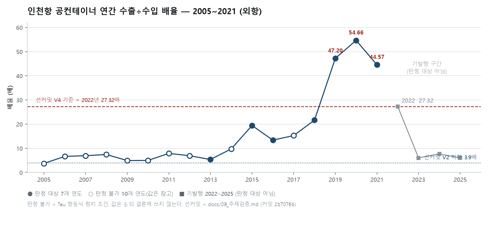
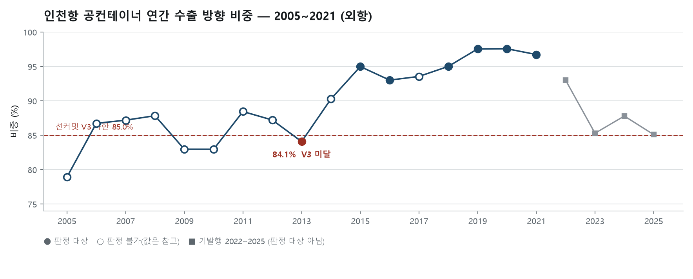

# #09 인천항 공컨테이너 시계열 17년 연장 — 우리가 이례로 봤던 해는 이례가 아니었다 (2005~2021년)

> [보고서 #01](report_01_공컨테이너_물동량.md)부터 [#08](report_08_관세청_인천항_수출입신고.md)까지 여덟 편이 전부 **2022년 이후** 데이터 위에 서 있다. 그 경계는 우리가 고른 것이 아니라 **원천이 거기까지라고 믿었기 때문**이다. 이번 편은 새 축을 열지 않는다 — **그 믿음이 맞는지**부터 확인하고, 틀렸다면 같은 방법을 뒤로 늘린다.

- **작성일**: 2026-08-30
- **분석 대상**: 2005~2021년 인천항 공(빈)컨테이너의 방향별 TEU. 모집단 `ocCt=1`(외항), 환적은 `GInOut` 3·4의 합. 2022~2025년 분석에 쓰이지 않은 구간에 대한 표본외 검증.
- **한 줄 결론**: 원천은 2022년이 아니라 **2005년**부터 있었다. 판정 기준 4개를 데이터 수집 전에 커밋하고 그대로 판정했다 — **V1·V2는 PASS, V3·V4는 FAIL**이다. 특히 2022년의 배율 **27.32배**는 최대가 아니었다: 2020년이 **54.66배**로 더 높다. 기준 무수정·사후조정 0건.

---

## 1. 핵심 요약

- **원천의 시작이 우리가 적어 둔 것과 달랐다.** 우리 기록은 「원천이 2022~다. 설계 문제가 아니라 자료 문제」였는데, 그 문장의 근거가 된 프로브는 **2022년 위쪽만 조회했다**. 아래로 조회하니 2005년까지 매년 12개월이 존재했다. 연도별로 **17개 연도**를 새로 받았다.
- **판정 기준 4개 중 둘이 FAIL이다.** V1(방향 지속)과 V2(배율 하한 **3.9배**)는 판정 가능한 7개 연도 전부에서 성립했다. V3(수출 방향 비중 **85.0%** 이상)는 2013년이 **84.1%**로 미달했고, V4(2022년이 전 기간 최대인가)는 2019·2020·2021년이 2022년을 웃돌아 성립하지 않았다.
- **V4의 내용이 이 편의 결과다.** 우리가 발행한 여덟 편은 2022년의 **27.32배**를 다른 해와 자릿수가 다른 값으로 다뤄 왔다. 판정 가능 구간에서 2019년 **47.20배**, 2020년 **54.66배**, 2021년 **44.57배**가 산출됐다. **2022년 값은 그 구간보다 낮은 쪽에 있다.**
- **2005~2017년 열세 개 연도는 적재일이 하나다** — 전부 `2018-06-27`이다. 당시에 공표된 것이 아니라 2018년에 한꺼번에 적재된 자료이고, 그 적재의 원자료와 방법을 이 API는 밝히지 않는다. **이 구간의 지위는 「관측」이며 「확정」으로 쓰지 않는다.**
- **10개 연도는 판정하지 못했다.** 규격 필드의 합이 TEU 합과 어긋나 정지 조건에 걸렸다. **통과로도 미성립으로도 세지 않고 「판정 불가」로 따로 센다.**

## 2. 분석 결과

### 2.1 검증 설계 — 기준을 먼저 못 박았다

기준 문서 `docs/09_주제검증.md`는 **값을 하나도 받기 전에** 커밋했다(커밋 `2b7076b`). 그 전에 실행한 프로브는 **존재 여부·월 목록·응답 연도만** 읽었고, 값 필드를 읽지 않는다는 사실을 그 스크립트의 인수시험이 강제한다(소스에 `forEmpTeu`·`to_csv` 같은 이름이 없어야 통과한다).

**2022~2025년은 판정 대상에서 뺐다.** 이미 발행에 쓴 구간이므로 그 구간으로 자기 기준을 통과시키는 것은 검증이 아니다. 이 편이 판정하는 것은 **2005~2021년뿐**이다.

경계 확인에는 **대조군을 양쪽에 세웠다.** 모든 연도가 「자료 있음」으로 나오는 결과는 **연도 파라미터가 무시될 때도 똑같이 나온다.** 위쪽 대조군(2022년, 「있음」)만으로는 그 둘이 갈리지 않으므로, 아래쪽에 있을 수 없는 연도(1990·1970)를 조회했다. 두 해 모두 정상 응답에 행 0으로 돌아왔고, 응답의 `yyyy`가 요청 연도와 같은지도 매 건 대조했다.

### 2.2 판정 결과

| 항목 | 기준 | 대상 | 결과 | 판정 |
|---|---|---|---|---|
| V1 방향 지속 | 연간 수출 TEU > 수입 TEU | 7개 연도 | 7/7 성립 | **PASS** |
| V2 배율 하한 | 연간 배율 ≥ 3.9 | 7개 연도 | 7/7 성립 | **PASS** |
| V3 수출 비중 하한 | 연간 ≥ 85.0% | 7개 연도 | 6/7 성립 · 2013년 미달 | **FAIL** |
| V4 2022년의 자리 | 2005~2021 중 27.32 이상 없음 | 7개 연도 | 2019·2020·2021이 초과 | **FAIL** |

판정 가능 연도는 2013·2015·2016·2018·2019·2020·2021년이다. 나머지 10개 연도는 §2.4의 정지 조건에 걸렸다.

### 2.3 연도별 값



**그림 1.** 채운 점이 판정 대상, 빈 점이 판정 불가다. **모양을 갈라 그린 이유는 하나다** — 같은 모양으로 그리면 그림이 「17개 연도 전부를 판정했다」고 말하게 된다. 회색은 기발행 구간이며 이 편의 판정 대상이 아니다. 세로축은 로그가 아니다.<sup>2</sup>



**그림 2.** 붉은 파선이 선커밋 V3 하한이다. 판정 대상 7개 연도 중 **2013년 하나만** 그 아래에 있다.

단위 TEU · 외항 `ocCt=1` · 환적은 `GInOut` 3·4의 합.

| 연도 | 공컨 전체 | 수출 방향 | 수입 방향 | 환적 | 수출÷수입 | 수출 비중 % | 판정 |
|---|---|---|---|---|---|---|---|
| 2005 | 209,567.0 | 165,413.00 | 44,150.00 | 4.0 | 3.75 | 78.9 | 판정 불가 |
| 2006 | 300,108.0 | 260,307.00 | 39,163.00 | 638.0 | 6.65 | 86.7 | 판정 불가 |
| 2007 | 423,399.0 | 369,203.00 | 53,170.00 | 1,026.0 | 6.94 | 87.2 | 판정 불가 |
| 2008 | 405,580.0 | 356,288.00 | 47,933.00 | 1,359.0 | 7.43 | 87.8 | 판정 불가 |
| 2009 | 325,659.0 | 270,224.00 | 54,741.00 | 694.0 | 4.94 | 83.0 | 판정 불가 |
| 2010 | 402,019.8 | 333,564.75 | 66,859.00 | 1,596.0 | 4.99 | 83.0 | 판정 불가 |
| 2011 | 394,094.0 | 348,595.00 | 44,187.00 | 1,312.0 | 7.89 | 88.5 | 판정 불가 |
| 2012 | 402,545.0 | 351,110.00 | 50,718.00 | 717.0 | 6.92 | 87.2 | 판정 불가 |
| **2013** | 453,345.0 | 381,200.25 | 70,980.75 | 1,164.0 | 5.37 | **84.1** | 판정 |
| 2014 | 522,013.2 | 471,306.00 | 48,337.25 | 2,370.0 | 9.75 | 90.3 | 판정 불가 |
| **2015** | 541,502.2 | 514,385.75 | 26,462.50 | 654.0 | 19.44 | 95.0 | 판정 |
| **2016** | 658,586.5 | 612,620.75 | 45,816.75 | 149.0 | 13.37 | 93.0 | 판정 |
| 2017 | 832,244.5 | 778,632.00 | 50,940.00 | 2,672.5 | 15.29 | 93.6 | 판정 불가 |
| **2018** | 835,959.5 | 794,298.25 | 36,702.25 | 4,959.0 | 21.64 | 95.0 | 판정 |
| **2019** | 838,016.5 | 817,591.75 | 17,320.75 | 3,104.0 | **47.20** | 97.6 | 판정 |
| **2020** | 935,041.2 | 912,400.25 | 16,691.00 | 5,950.0 | **54.66** | 97.6 | 판정 |
| **2021** | 935,085.2 | 904,624.00 | 20,296.25 | 10,165.0 | **44.57** | 96.7 | 판정 |

굵은 연도가 판정 대상이다. **「판정 불가」 연도의 값은 참고 통계이며 결론에 쓰지 않는다.**<sup>1</sup>

### 2.4 정지 조건 — 10개 연도가 걸렸다

`forEmpTeu = 0.5×_10 + 1×_20 + 2×_40 + 2.25×_99` 항등식을 외국적·한국적 각각에 적용했다.

| 연도 | 불일치 / 검사 행 | 최대 잔차 |
|---|---|---|
| 2005 | 16 / 192 | 8.25 |
| 2006 | 17 / 192 | 6.75 |
| 2007 | 17 / 192 | 5.00 |
| 2008 | 19 / 192 | 1.50 |
| 2009 | 17 / 192 | 1.75 |
| 2010 | 7 / 180 | 13.50 |
| 2011 | 8 / 166 | 94.50 |
| 2012 | 2 / 166 | 1.00 |
| 2014 | 1 / 150 | 27.00 |
| 2017 | 1 / 154 | 112.50 |
| 2013·2015·2016·2018·2019·2020·2021 | 0 | — |

불일치 연도는 전부 2005~2017년 구간 안에 있고, 2018~2021년은 0건이다. **두 사실이 같이 관측됐다는 것만 적는다.**

**이 정지가 보수적이라는 점을 밝힌다.** 항등식이 검사하는 것은 규격 축(10·20·40ft·기타)이고, V1~V4는 TEU 합만 쓴다. 규격 내역이 어긋난 연도라도 TEU 합 자체는 성립할 수 있다. **그런데도 뺐다** — 선커밋이 그렇게 걸려 있었기 때문이다. **결과를 보고 기준을 넓히는 것이 사후조정이다.**

### 2.5 적재일

`esbCntcDt`(적재일)를 함께 받았다.

| 자료 연도 | 적재일 |
|---|---|
| 2005 ~ 2017 (13개 연도) | 전부 `2018-06-27` |
| 2018 | `2019-02-28` · `2019-03-14` |
| 2019 | `2020-02-26` |
| 2020 | `2021-04-01` |
| 2021 | `2022-04-19` |

2018년 이후는 이듬해 초에 한 해씩 적재된다 — 지금 우리가 받는 주기와 같다. **2005~2017년은 그 주기 밖에 있고, 하나의 날짜에 묶여 있다.**

### 2.6 실행 게이트

| 게이트 | 결과 |
|---|---|
| 회귀 앵커 | **일치** — 같은 코드로 2025년 재수집: 전체 991,170 TEU · 수출 843,838 TEU · 수입 139,418 TEU |
| 연도 파라미터 | 통과 — 17개 연도 전부 응답 `yyyy` = 요청 연도 |
| 월 소실 | 통과 — 17개 연도 전부 1~12월 |
| Teu 항등식 | 10개 연도 정지 (§2.4) |
| 스키마 변화 | 통과 — 태그 집합 1종, 2022년과 동일 |

## 3. 해석

### 3-1. 우리가 발행한 여덟 편에 이 편이 하는 일

여덟 편은 전부 2022년 이후 데이터 위에 서 있고, 그 사실을 각 편이 밝히고 있다. 이 편은 **그중 하나의 서술을 좁힌다.**

**2022년의 27.32배는 「4개년 중 최대」였고, 그 범위에서는 지금도 맞다.** 이 편이 더하는 것은 그 범위 밖의 값이다 — 판정 가능한 7개 연도 안에서 2019년 **47.20배**, 2020년 **54.66배**, 2021년 **44.57배**가 산출됐다. **2022년 값은 그보다 낮다.**

V1과 V2는 성립했다. 방향의 부호와 배율 하한 **3.9배**는 판정 가능 구간 7개 연도에서 유지됐다.

### 3-2. V3가 FAIL이라는 것의 뜻

수출 방향 비중 하한 **85.0%**는 2022~2025년 관측 최소값에서 가져온 기준이다. 2013년이 **84.1%**로 그 아래에 있다.

**기준을 2013년 값 아래로 내리면 PASS가 된다. 내리지 않았다.** 결과를 보고 기준을 옮기면 그 기준은 아무것도 판정하지 않는다. 이 값은 FAIL로 남고, 다음 편이 다른 기준을 쓰려면 **그 편의 데이터를 보기 전에** 커밋해야 한다.

### 3-3. 이 데이터로 판별할 수 없는 것

- **배율이 왜 그렇게 움직였는지.** 이 편은 연도별 값과 기준 성립 여부만 낸다. 「전환」·「회복」·「추세」 같은 말도 값이 아니라 해석이다.
- **2005~2017년 소급 적재의 원자료와 방법.** API가 밝히지 않는다.
- **그 구간이 그 뒤로 수정된 적이 있는지.** 적재일이 하나뿐이라 수정 흔적이 없다. **흔적이 없는 것과 수정이 없었던 것은 같지 않다.**
- **항등식 불일치와 소급 적재의 관계.** 두 사실이 같은 구간에서 관측됐다는 것 외에는 이 데이터가 답하지 않는다.
- **조합 축이 줄어든 이유.** 2005~2009년은 `GInOut`×`ocCt` 8개 조합이 매월 오고 2021년은 6개다. **어느 조합이 언제 사라졌는지는 이 편에서 보지 않았다.**

## 4. 한계와 후속

### 4.1 한계

- **판정 대상이 7개 연도다.** 17개 중 10개가 정지 조건에 걸렸다. 이 편의 PASS/FAIL은 그 7개에 대한 것이고, **나머지 10개 연도에 대해서는 아무것도 판정하지 않았다.**
- **2005~2017년의 지위는 「관측」이다.** §2.5의 적재일 때문이다. 「확정」으로 쓰지 않는다.
- **표본외라는 말의 범위.** 이 구간은 기존 여덟 편의 분석에 쓰이지 않았다는 뜻에서 표본외이고, **그 이상의 독립성을 주장하지 않는다** — 같은 기관의 같은 API다.
- **정지 조건이 처음에는 발화하지 않았다.** 항등식 게이트가 실제와 다른 태그 이름을 조회해 17개 연도 전부 「검사 대상 0행」을 냈다. 고친 뒤 다시 수집해 위 판정을 냈다. **이 표는 게이트가 발화한 상태의 결과다.** 경위는 `docs/사고기록.md` 77번에 있다.

### 4.2 후속

- **규격 축을 쓰지 않는 편이라면 17개 연도 전부를 판정할 수 있다.** 그 편의 기준은 그 편의 데이터를 보기 전에 커밋한다.
- **조합 축의 소멸 시점**은 아직 보지 않은 축이다.
- **2005~2017년 소급 적재의 출처**는 이 API 밖에서 확인해야 한다.

## 부록 — 재현

```
python analysis/probe/probe_14_year_floor.py     # 시작 경계 (값을 읽지 않는다)
python analysis/collect_09_backfill.py           # 수집 + 판정
python analysis/collect_09_backfill.py --selftest
```

- 기준 문서: `docs/09_주제검증.md` (커밋 `2b7076b`, 값 수집 이전)
- 판정 기록: `docs/09_판정결과.md`
- 원자료: `analysis/container_2005_2021_direction.csv` (1,431행 · 16열)
  — **정지 조건에 걸린 연도의 행도 전부 들어 있다.** 정지는 판정에서 빼는 것이지 기록에서 지우는 것이 아니다.

## 표기

| 항목 | 내용 |
|---|---|
| **검수·발행** | **운영자** — 발행 결정(2026-09-03 · 운영자 지시로 발행됨). **발행 전 결론 자리 통독과 무작위 수치 1건의 출처 대조는 아직 수행되지 않았다.** 수행되면 `docs/검수기록.md`에 기록하고 이 행을 갱신한다. 발행물의 책임은 운영자에게 있다. |
| **데이터 출처** | 공공데이터포털 — 인천항만공사 공컨테이너 화물 통계 API (`ipaEmpConCargoInfo`) |
| **재현 코드** | 위 「부록 — 재현」의 스크립트 전부가 이 저장소에 공개돼 있다. 원시 CSV도 함께 있다. |

---

**각주**

1. 「판정 불가」 연도의 값은 §2.3 표에 그대로 싣되 **참고 통계**로만 쓴다. 결론(제목·한 줄 결론·핵심 요약·해석)에는 인용하지 않는다. 값을 감추지 않는 것과 결론에 쓰는 것은 다른 일이다.
2. 세로축을 로그로 펴면 **차이가 실제보다 작아 보인다.** 3.75와 54.66을 한 축에 놓으면 아래쪽이 눌리지만, 이 그림의 요점이 「위쪽이 얼마나 높은가」이므로 눌리는 쪽을 택했다.
