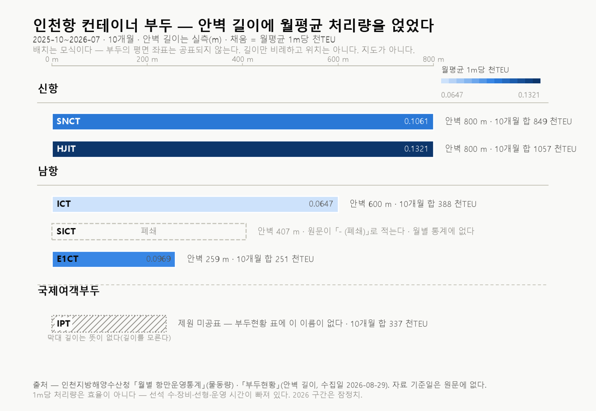

# #11 인천항 컨테이너 터미널별 처리량 — 합계 한 줄은 다섯 곳을 대표하지 않는다 (2025-10~2026-07)

> [보고서 #01](report_01_공컨테이너_물동량.md)부터 [#09](report_09_공컨테이너_시계열연장.md)까지 아홉 편과 판정만 끝낸 #10은 전부 **항 전체**를 본다. 방향·비율·규격·배율·비중이 모두 인천항 하나로 합쳐진 값이다. 이번에는 새 축을 연다 — **그 합계를 터미널 다섯으로 갈랐을 때 무엇이 달라 보이는가**를 묻는다. 기준을 먼저 걸고, 그다음에 값을 계산했다.
>
> **제목이 말하는 「대표하지 않는다」의 범위는 하나다 — 전년대비 부호의 동행이다.** 이 편이 그 자리에서 잰 것이 그것뿐이다. 몫의 순위와 하한은 같은 창에서 성립했고(T1·T2 PASS), **수준·증감폭·상관은 이 편이 재지 않았다.** 제목을 그 밖으로 넓혀 읽지 않는다.

- **작성일**: 2026-09-11
- **분석 대상**: 2025-10~2026-07 인천항 컨테이너 터미널별 월별 처리량(천TEU)과 안벽 길이(m). 터미널 다섯(SNCT·HJIT·ICT·E1CT·IPT), 부두군 셋(신항·남항·국제여객부두), 10개월. 소스는 인천지방해양수산청 「월별 항만운영통계」와 「부두현황」.
- **한 줄 결론**: 판정 기준 4개를 값 계산 전에 커밋하고 그대로 판정했다 — T1·T2 PASS, T3·T4 FAIL. 공표 합계의 전년대비 부호가 터미널 다섯 전부의 부호와 같은 달은 10개월 중 **1개월**이었다. 신항 몫은 **63.4~68.8%** 구간에 있었고, 안벽 1m당 월평균 처리량은 **0.0647~0.1321 천TEU/m** 로 갈렸다. 기준 무수정·사후조정 0건.

---

## 1. 핵심 요약

- **터미널 축 4개 기준 중 둘이 FAIL.** 판정 기준 T1~T4는 터미널별 값을 계산하기 전에 문서로 커밋했고(git blob `e8789fb0…`), 판정 뒤에도 고치지 않았다.
- **동행하지 않는다.** 공표 합계의 전년대비 부호가 터미널 다섯 전부의 부호와 같은 달은 10개월 중 **1개월**(2025-11)이다. 기준은 6개월 이상이었다 — **T3 FAIL**.
- **몫의 순위는 유지된다.** 신항 > 남항 > 국제여객부두 순서가 10개월 내내 같다(**T1 PASS**). 신항 몫은 최소 **63.4%**, 최대 **68.8%** 구간에 있었고 하한 50.0%를 한 달도 밑돌지 않았다(**T2 PASS**). 국제여객부두 몫의 최소는 **9.7%**다.
- **안벽 1m당 순위는 한 달 뒤집혔다.** 대응 4곳의 월별 순위는 **2종**으로 나왔다 — 9개월과 1개월이다(**T4 FAIL**). 월평균 값의 최대는 **0.1321 천TEU/m**, 최소는 **0.0647 천TEU/m**다.
- **창이 10개월인 것은 원천이 10개월이어서가 아니다.** 이 축의 원천인 인천지방해양수산청 「월별 항만운영통계」 게시판 목록은 **23쪽**이고, 가장 이른 항만운영통계 글은 **2006년 9월**분이다(측정 2026-09-11). 우리 수집기가 그 목록의 **첫 쪽 10건만** 읽어 CSV 가 열 달이 됐다 — **창을 고른 것이 아니라 수집기의 기본값이 창을 정했다.** 판정 구간은 선커밋이 고정한 그대로 두고, 이 사실을 §4.1에 한계로 적는다. **수집기는 고친다** — 목록 깊이를 보게 고쳐 **원천이 실제로 어디까지 있는지 다시 재고, 그 구간으로 새 선커밋을 세우는 것이 다음 편이다**(§4.2). 이 편의 판정은 그 전에 난 것이고 그대로 둔다. 확인 = `python analysis/probe/probe_15_board_depth.py`.
- **지표마다 모집단이 다르다.** T1·T2 는 **부두군 셋**, T3 는 **공표 합계 하나와 터미널 다섯**, T4 는 **부두현황과 이름이 대응되는 터미널 넷**을 본다. 제목의 「다섯」은 T3 의 모집단이고, T4 에서 IPT 는 제원이 없어 빠진다.
- **2026년 수치는 전 구간 잠정치다.** 이 편의 10개월 중 일곱 달이 그 구간에 있다.

## 2. 분석 결과

### 2.1 판정 설계 — 기준을 먼저 못 박았다

이번 편은 **축을 옮기는 편**이다. 아홉 편과 #10이 쓴 데이터는 방향·규격을 갖지만
터미널 구분을 갖지 않는다. 반대로 이 편의 소스는 터미널을 갖지만 **방향 열이 없다.**
같은 항을 다른 층에서 보는 것이지, 앞 편들의 결론을 다시 재는 것이 아니다.

핵심은 순서다. **판정 기준 T1~T4를 터미널별 값을 계산하기 전에 선언**하고 저장소에 커밋했다.
기준 문서는 `docs/11_주제검증.md`이며, 해당 시점의 git blob 해시는
`e8789fb0311ef6b804f23459c3373a0217805373`다.

| 기준 | 모집단 | 판정 대상 | 통과 조건 |
|---|---|---|---|
| T1 몫 순위 지속 | 부두군 3 (신항·남항·국제여객부두) | 10개월 각각 | 신항 > 남항 > 국제여객부두 |
| T2 신항 몫 하한 | 부두군 1 (신항) · 분모 = 공표 합계 | 10개월 각각 | 신항 몫 ≥ 50.0% |
| T3 증감 동행 | 공표 합계 1 + 터미널 5 | 10개월 | 합계와 터미널 다섯의 전년대비 부호가 모두 같은 달 ≥ 6개월 |
| T4 안벽 생산성 순위 지속 | 터미널 4 (부두현황과 이름이 대응되는 것) | 10개월 각각 | 대응 터미널의 1m당 처리량 순위가 내내 같다 |

**모집단은 기준마다 다르고, 그 차이는 선커밋이 정한 것이다.** T4 만 넷인 것은 부두현황 표에 IPT 의 제원이 없어서다 — 선커밋 게이트 3·4가 「대응 안 되는 이름은 판정 불가로 따로 센다」를 미리 적었다. **다섯 곳 전부를 보는 것은 T3 하나다.**

**T2의 하한 50.0%는 관측값이 아니라 선언값이다.** 기준을 쓰는 시점에 대장이 든 터미널 몫은
**2026-07 한 달**(신항 65.2%)뿐이었고, 한 달의 값을 하한으로 삼으면 그 달 자신이 걸린다.
선커밋 문서가 이 약점을 그 자리에 적어 뒀다. **약한 기준은 통과해도 적게 말한다.**

**T3 은 반대쪽으로 치우쳐 있었다 — 그것도 여기 적는다.** 터미널 다섯의 전년대비 부호가 서로
무관하고 양·음이 반반이라면, 다섯이 한 방향으로 모일 확률은 `2 × (1/2)^5` 이고 10개월 기대치는
**0.625개월**이다.1 기준이 요구한 **6개월 이상**은 그 기대치의 약 열 배다.
**즉 T3 은 사전에도 통과 가능성이 낮은 값이었고, 관측 1개월은 그 기대치와 사실상 같다.**
계산은 판정 코드가 하고 인수시험이 값을 고정한다 — **판정에는 쓰지 않는다.**
**기준은 고치지 않는다**(§3-7). 사후에 고친 기준으로 낸 판정은 아무것도 말하지 않는다.

### 2.2 판정 결과 — T1·T2 PASS, T3·T4 FAIL

| 기준 | 모집단 | 결과 | 판정 |
|---|---|---|---|
| T1 몫 순위 지속 | 부두군 3 | 10/10 성립 | **PASS** |
| T2 신항 몫 ≥ 50.0% | 부두군 1 | 10/10 성립 (63.4~68.8%) | **PASS** |
| T3 증감 동행 | 합계 1 + 터미널 5 | 1개월 (기준 6개월 이상) | **FAIL** |
| T4 안벽 생산성 순위 지속 | 터미널 4 | 순위 2종 (9개월 + 1개월) | **FAIL** |

**PASS 2 · FAIL 2 · 판정 불가 0.** 판정 전문은 `docs/11_판정결과.md`가 든다.

### 2.3 T3 상세 — 합계 부호와 터미널 부호

각 달의 전년대비 당월 부호다. **0은 양에도 음에도 넣지 않았다.**

| 달 | 합계 | E1CT | HJIT | ICT | IPT | SNCT | 여섯이 같은가 |
|---|---|---|---|---|---|---|---|
| 2025-10 | − | + | − | − | − | − | 아니다 |
| 2025-11 | + | + | + | + | + | + | **같다** |
| 2025-12 | − | + | + | + | − | − | 아니다 |
| 2026-01 | + | + | + | + | + | − | 아니다 |
| 2026-02 | + | + | + | − | + | − | 아니다 |
| 2026-03 | − | + | 0 | − | − | − | 아니다 |
| 2026-04 | − | + | + | − | − | − | 아니다 |
| 2026-05 | + | + | + | + | − | − | 아니다 |
| 2026-06 | + | + | + | + | − | − | 아니다 |
| 2026-07 | + | + | + | + | − | − | 아니다 |

E1CT는 10개월 전부 양(+)으로, SNCT는 9개월이 음(−)으로 산출됐다. 그 사이에서 합계 부호는 **다섯 번 바뀌어 여섯 구간**이 된다.4
**합계가 양인 6개월 가운데 5개월에서 최소 한 곳이 음이었다.**

**합계를 빼고 터미널 다섯만 봐도 같은 수다.** 다섯이 한 방향으로 모인 달도 **1개월**(2025-11)이다 —
합계는 다섯의 합이라 독립된 여섯째 계열이 아니고, 그래서 §2.1이 든 기대치는 **다섯**으로 센 것이다.
**이 창의 부호 분포는 반반이 아니다** — E1CT 10/10 양, SNCT 9/10 음. 그러므로 위 기대치는
이 데이터의 서술이 아니라 **기준이 얼마나 빡빡했는지를 재는 자**다.

### 2.4 T1·T2 상세 — 부두군 몫

몫의 분모는 **계층 `합계`의 당월 천TEU**(공표 합계)다. 다섯 곳의 합이 아니다.

| 달 | 신항 | 남항 | 국제여객부두 |
|---|---|---|---|
| 2025-10 | 63.4% | 23.3% | 13.3% |
| 2025-11 | 64.4% | 21.8% | 13.9% |
| 2025-12 | 63.9% | 23.8% | 12.6% |
| 2026-01 | 66.2% | 21.2% | 12.6% |
| 2026-02 | 66.8% | 22.8% | 10.0% |
| 2026-03 | 66.3% | 21.5% | 12.2% |
| 2026-04 | 67.2% | 21.2% | 11.3% |
| 2026-05 | 68.8% | 21.1% | 10.1% |
| 2026-06 | 68.5% | 21.8% | 9.7% |
| 2026-07 | 65.2% | 23.4% | 11.3% |

몫의 폭은 신항 5.4%p, 남항 2.7%p, 국제여객부두 4.2%p로 산출됐다(참고 통계).

### 2.5 T4 상세 — 안벽 1m당 처리량

*그림에서 **실측은 가로 하나뿐이다** — 막대의 길이가 안벽 길이(m)다. **세로 배치·순서·간격은 모식이고 뜻이 없다.** 부두의 평면 좌표는 공표되지 않으므로 이 그림은 지도가 아니다. 채움 농도는 월평균 1m당 천TEU다.*

안벽 길이는 SNCT 800 m, HJIT 800 m, ICT 600 m, E1CT 259 m다. 월별 순위는 9개월이
`HJIT > SNCT > E1CT > ICT`, 1개월(2025-12)이 `HJIT > E1CT > SNCT > ICT`로 산출돼 **2종**이 됐다.
HJIT가 최고, ICT가 최저인 것은 10개월 내내 같다.

**이 값은 효율이 아니다.**2 선석 수·장비·선형·운영 시간이 전부 빠져 있다.
여기 있는 것은 1m당 천TEU와 그 순위뿐이다.

### 2.6 실행 게이트

| 게이트 | 결과 |
|---|---|
| 소스 실재 | 통과 — 출처 대장 10달, `SHA256_앞16` 전부 있음, 달 집합 일치 |
| 완전성 | 통과 — 10개월 각각 합계 1·부두군 2·터미널 5 |
| 결합(이름 대응) | 기록 — 대응 4곳, 물동량에만 IPT, 부두현황에만 SICT |
| 분모 0·부재 | 해당 없음 |
| 항등식 | 기록 — 다섯 곳 합 − 공표 합계는 ±1 천TEU 안 |

**두 표의 터미널 이름 집합이 다른 이유는 원문 안에 있다.**3 부두현황의 `주요취급화물` 열이
SICT를 `- (폐쇄)`로 적는다. **두 표는 서로 맞다** — 닫힌 부두가 월별 물동량 표에 없는 것이다.
IPT는 반대로 물동량은 있고 부두현황에 이름이 없어, 안벽 판정에서 제외했다.

## 3. 해석

### 3-1. 합계 한 줄이 말하지 않는 것

10개월 중 9개월에서, 공표 합계의 전년대비 부호는 **터미널 다섯 전부의 부호가 아니다.**
합계가 양인 달에도 최소 한 곳은 음이었고, 합계가 음인 달에도 최소 한 곳은 양이었다.
**항 전체 한 줄을 읽는 것과 터미널 다섯을 읽는 것은 같은 일이 아니다.**

이것은 합계가 틀렸다는 뜻이 아니다. 합계는 합계로서 맞다.
**말할 수 있는 것은 대표성의 범위다** — 이 창에서 합계 부호는 다섯 곳의 공통 방향이 아니었다.

**그 범위는 부호 하나다.** 이 편이 잰 것은 **전년대비 부호의 동행**이고, 제목의 「대표하지 않는다」는
그 한 축 안에서 읽는다. **합계가 다섯 곳의 수준·증감폭·변동을 대표하는지는 이 편이 재지 않았다** —
다섯 곳 사이의 상관도 마찬가지다. 그것들은 각각 다른 기준을 세워야 갈리고, **재지 않은 것은
제목이 말하지 않는다.** 같은 창에서 몫의 순위와 하한은 성립했다(T1·T2 PASS) — **한 축의 FAIL 이
다른 축의 FAIL 이 아니다.**

### 3-2. PASS 둘과 FAIL 하나가 서로 다른 무게를 갖는다

T1(순위 지속)은 10개월 내내 성립했다. **순위는 값의 크기를 묻지 않는 명제**라
몫이 얼마를 움직이든 순서만 지켜지면 성립한다(폭은 §2.4의 참고 통계에 있다).

T2는 다르다. 하한 50.0%는 관측이 한 달뿐이라 **선언한 값**이고, 실제 최소는 63.4%였다.
**하한과 실제 최소 사이가 그만큼 벌어진 채 통과한 것은 값이 안정적이라는 증거가 아니라
기준이 느슨했다는 증거다.**
다음 편이 이 창의 관측 최소 63.4%를 근거로 더 좁은 기준을 쓸 수 있다.

**T3 은 그 반대쪽이고, 같은 잣대를 그쪽에도 댄다.** §2.1이 계산한 대로 무상관·등확률 가정에서
10개월 기대치는 **0.625개월**이고, 기준이 요구한 6개월은 그 약 열 배다. **관측 1개월은 그
기대치와 사실상 같다.** 그러므로 이 FAIL 이 말하는 것은 **「기대보다 덜 동행했다」가 아니라
「기대를 크게 웃도는 수준의 동행을 요구했고 그 수준이 아니었다」**이다.
**느슨한 기준의 PASS가 값의 안정을 증명하지 않는 것과 같이, 빡빡한 기준의 FAIL 도
값의 이상을 증명하지 않는다.** 남는 것은 §3-1이 적은 한 줄 — **이 창에서 합계 부호는
다섯 곳의 공통 방향이 아니었다.** **기준은 양쪽 다 고치지 않았다**(§3-7).

### 3-3. 이 데이터로 판별할 수 없는 것

- **방향을 터미널별로 가를 수 없다.** 이 소스에 방향 열이 없다. #01~#10이 세운 방향 축은
  **항 전체에서만** 성립하고 터미널 층으로 내려가지 않는다. 두 축을 한 문장에 붙이면 안 된다.
- **왜 그런지는 답하지 않는다.** 선사 기항·선형·계약·항로 개편 어느 것도 이 데이터에 없다.
- **10개월은 계절성을 가르지 못한다.** 같은 달의 서로 다른 해가 한 번씩만 있다.

## 4. 한계와 후속

### 4.1 한계

- **10개월이다.** 이 창은 앞 편들이 쓴 48개월·204개월보다 훨씬 짧다.
- **그 10개월은 수집기의 기본값이 정한 창이다 — 원천의 한계가 아니다.**
  `collect_terminal_monthly.py`의 `list_posts()`가 게시판 목록에 `pageindex`를 안 붙여
  **첫 쪽 10건만** 읽는다. 목록은 **23쪽**이고 가장 이른 항만운영통계 글은 **2006년 9월**분이다
  (측정 2026-09-11 · `analysis/probe/probe_15_board_depth.py`).
  **판정 구간은 선커밋이 고정한 그대로 두었다** — 값을 본 뒤에 창을 넓히면 그것이 사후조정이다(§3-7).
  **옛 글의 첨부에 터미널 표가 있는지는 [미확인]이다.** 글이 있는 것과 축이 있는 것은 다르다.
  **이 한계는 남겨 두는 것이 아니라 고친다.** `list_posts()`가 목록 깊이를 보게 고치고,
  터미널별 내역이 실제로 어느 달까지 있는지 **값 비노출 프로브로 먼저 재서** 구간을 확정한 뒤,
  **그 구간으로 새 선커밋을 세운다.** 이 편의 기준을 그 구간에 다시 쓰지 않는다 —
  같은 기준을 넓은 창에 옮겨 붙이면 기준이 창을 따라간 것이 되고, 그것이 §3-7이 막는 것이다.
- **2026 구간은 잠정치다.** 10개월 중 일곱 달이 그 구간이고, 사후 수정될 수 있다.
- **안벽 길이의 자료 기준일이 원문에 없다.** 우리가 아는 것은 수집일(2026-08-29)뿐이다.
- **IPT의 제원이 없다.** 물동량은 있고 부두현황에 이름이 없어 1m당 판정에서 빠졌다.
  **그래서 T4의 모집단은 넷이고, 다섯 곳 전부를 보는 기준은 T3 하나다**(§2.1 표).
- **부두군 분류는 공표자료의 것이다.** 우리 배정이 아니다.
- **T2가 약한 기준이고 T3이 빡빡한 기준이었다.** 위 3-2 그대로다.

### 4.2 후속

- **관측 최소 63.4%를 근거로 한 좁은 기준.** 이 편이 그 근거값을 만들었다.
- **수집기를 고치고 전 구간을 다시 잰다 — 이것이 다음 편이다.** `list_posts()`가 목록 깊이를
  보게 고친 뒤, **터미널별 내역이 어느 달까지 있는지**를 값 비노출 프로브로 먼저 확인한다.
  게시판에 글이 2006년 9월분까지 있다는 것은 확인했지만(위 4.1), **글이 있는 것과 그 축이 있는 것은 다르다** —
  터미널 개장 시기가 제각각이라 글 수가 그대로 관측 개월 수가 되지 않는다.
  **받아 낸 구간으로 새 선커밋을 세운다.** 이 편의 기준은 재활용하지 않고, **이 편은 정정하지 않는다.**
- **다섯 터미널 사이의 상관.** 이 편은 부호 동행만 쟀고 상관은 재지 않았다 — 별도 기준을 세워야 갈린다.
- **방향 축과 터미널 축의 결합.** 두 축을 함께 갖는 소스가 있는지는 아직 안 봤다.

## 부록 — 재현

| 항목 | 위치 |
|---|---|
| 판정 기준 (사전 선언) | `docs/11_주제검증.md` |
| 판정 결과 전문 | `docs/11_판정결과.md` |
| 수치 정본 대장 | `docs/FACTS.md` |
| 판정 코드 | `analysis/judge_11_terminal.py` |
| 도해 코드 | `analysis/chart_11_terminal_plan.py` |
| 데이터 (물동량) | `analysis/terminal_monthly.csv` · 출처 대장 `analysis/terminal_monthly_sources.csv` |
| 데이터 (부두 제원) | `analysis/port_container_berths.csv` |
| 창의 출처 확인 (값 비노출) | `analysis/probe/probe_15_board_depth.py` — 게시판 쪽수와 가장 이른 글 |

## 표기

| 항목 | 내용 |
|---|---|
| **검수·발행** | **운영자** — 발행 결정. **발행 전 결론 자리 통독과 무작위 수치 1건의 출처 대조는 아직 수행되지 않았다.** 수행되면 `docs/검수기록.md`에 기록하고 이 행을 갱신한다. 발행물의 책임은 운영자에게 있다. |
| **데이터 출처** | 인천지방해양수산청 — 「월별 항만운영통계」(터미널별 처리량) · 「부두현황」(안벽 길이, menuIdx=1774) |
| **재현 코드** | 위 「부록 — 재현」의 스크립트 전부가 이 저장소에 공개돼 있다. 원시 CSV도 함께 있다. |

---

**각주**

1. 이 기대치는 **가정 위의 계산값이고 관측이 아니다.** 다섯 계열의 전년대비 부호가 서로 무관하고 양·음이 각각 1/2이라고 두면, 다섯이 한 방향으로 모일 확률이 `2 × (1/2)^5 = 0.0625`이고 10개월 기대치가 `0.625개월`이다. **합계는 다섯의 합이라 독립된 여섯째 계열로 세지 않는다.** 가정 자체는 이 데이터로 검증하지 않았고, 이 창의 부호 분포는 실제로 반반이 아니다(§2.3). 그러므로 이 값은 **기준의 사전 난이도를 재는 자일 뿐 판정에 쓰지 않는다.** 계산과 값 고정은 `analysis/judge_11_terminal.py`와 그 인수시험에 있다.
2. 안벽 1m당 처리량은 **월평균 천TEU를 안벽 길이 합으로 나눈 값**이다. 선석 수·하역 장비·기항 선형·운영 시간이 분모에 들어 있지 않으므로 효율·경쟁력·우위의 근거가 아니다. E1CT는 안벽이 259 m로 가장 짧고, 짧은 분모는 같은 물동량에서 큰 값을 낸다.
3. 이 편의 선커밋 문서는 두 표의 이름 집합 차이를 「이미 본 어긋남」으로 적었으나, 판정 과정에서 그것이 어긋남이 아니라는 것이 원문 안에서 드러났다. 정정 경위는 `docs/11_판정결과.md` §2에 있다.
4. 2026년은 잠정치, 2025년 10~12월은 확정치다. 두 값의 성격이 다르다.
5. **정정 [2026-09-13].** 이 문장은 발행 당시 「합계 부호는 **6번** 바뀐다」로 나갔다. **틀렸다** — 부호 차례 `−,+,−,+,+,−,−,+,+,+` 에서 **바뀐 횟수는 5이고 구간(런)이 6**이다. 원인은 하나다: **이 수를 코드가 세지 않고 사람이 손으로 셌다**(§3 — 수치는 사람이 나르지 않는다). 지금은 `analysis/judge_11_terminal.py` 가 두 값을 같이 세고 인수시험이 고정한다. **판정값에는 영향이 없다** — T3 은 「여섯 부호가 모두 같은 달의 수」로 판정하고 이 수는 참고 서술이다. 경위 = `docs/사고기록.md` 117.
