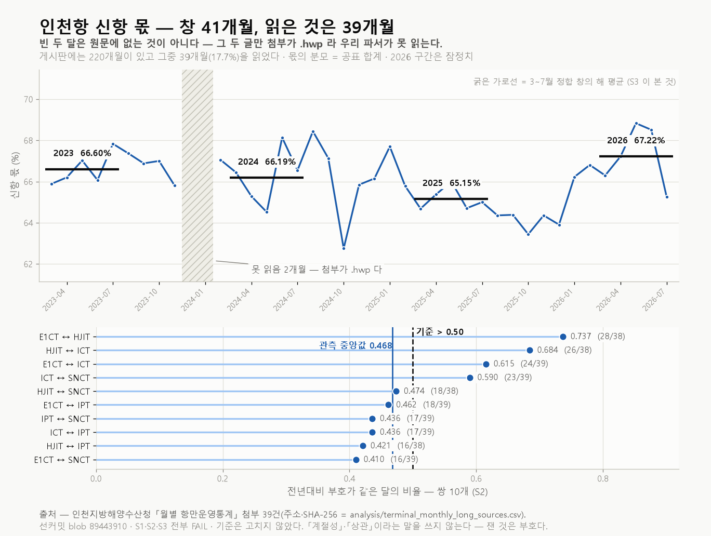

# #12 인천항 컨테이너 터미널별 처리량 — 220개월 중 39개월: 기준 셋을 다 못 넘었다 (2023-03~2026-07)

> [#11](report_11_터미널별_처리량.md)이 같은 데이터를 **10개월**로 쟀다. 이 편은 **같은 데이터를 39개월로 다시 잰다.** 두 번 재는 이유는 하나다 — **#11 의 창이 우리가 고른 창이 아니었다.** 그 편의 수집기가 게시판 목록의 **첫 쪽만** 읽어 열 달이 됐고, 그 사실을 #11 본문이 적고 「수집기를 고쳐 다시 잰다」를 예고했다. 이 편이 그것이다. **창이 늘어난 경위가 이 편의 절반이고, 나머지 절반이 그 창에서 새로 세운 기준 셋이다.**
>
> **제목이 말하는 「220개월 중 39개월」의 범위는 하나다 — 우리가 읽은 달의 수다.** 게시판에는 220개월이 다 있고, **2023-02 이전은 첨부가 `.hwp`·`.xls` 라 우리 파서가 못 연다.** 「원문에 없다」가 아니다. **읽는 일은 이 편에 넣지 않았다**(§4.2). 그리고 **#11 의 기준(T1~T4)을 이 창에 옮겨 쓰지 않았다** — 새 기준 셋을 새로 커밋했다.

- **작성일**: 2026-09-13 (선커밋 2026-09-12 · blob `89443910`)
- **분석 대상**: 2023-03~2026-07 인천항 컨테이너 터미널별 월별 처리량(천TEU). **창 41개월 · 관측 39개월 · 판정 불가 두 달**(2023-12·2024-01). 터미널 다섯(SNCT·HJIT·ICT·E1CT·IPT), 부두군 셋(신항·남항·국제여객부두). 소스는 인천지방해양수산청 「월별 항만운영통계」.
- **한 줄 결론**: 판정 기준 셋을 값 계산 전에 커밋하고 그대로 판정했다 — **S1·S2·S3 전부 FAIL.** 신항 몫 편차 부호가 관측된 모든 해에서 같은 역월은 **2개월**이었고(기준 7개월 이상), 터미널 쌍 열의 전년대비 부호 일치율 중앙값은 **0.468**이었고(기준 0.50 초과), 3~7월 정합 창의 연평균 신항 몫은 단조가 아니었다. **기준 무수정·사후조정 0건.**

---

## 1. 핵심 요약

- **같은 데이터를 두 번 재는 이유는 창이다.** #11 은 10개월, 이 편은 39개월이다. **#11 의 창은 고른 창이 아니라 수집기의 기본값이 정한 창이었다** — 그 편이 그것을 본문에 적고 고치겠다고 예고했고, 이 편이 그 예고를 이행한 것이다. **판정은 서로 독립이다** — 기준이 다르고 창이 다르다.
- **창은 41개월인데 관측은 39개월이다.** 빈 두 달(2023-12·2024-01)은 **그 두 글만 첨부가 `.hwp`** 이고, 이웃 달은 `.hwpx` 다(원문 확인). **「원문에 없다」가 아니라 「우리가 못 읽는다」다.** 같은 이유로 2023-02 이전 전체가 빠져 있다 — 게시판이 든 **220개월** 가운데 우리가 읽은 것은 **39개월**, 곧 **17.7%** 다.
- **S1 FAIL — 같은 역월의 되풀이가 우연 수준이었다.** 신항 몫 편차 부호가 관측된 모든 해에서 같은 역월은 **2개월**(11월·12월)이다. 기준은 7개월 이상이었고, **선커밋이 미리 적어 둔 귀무기대는 2.875개월**이다. **관측은 그 기대치와 사실상 같다.**
- **S2 FAIL — 그런데 이 기준은 동전이었다.** 터미널 쌍 열의 부호 일치율 중앙값이 **0.468**이고 기준은 0.50 초과였다. **귀무기대가 정확히 0.50 이라 사전 통과 가능성이 절반**이었고, 그 절반에서 떨어졌다. **쌍 사이의 폭은 넓다** — 위쪽과 아래쪽이 갈린다(§2.5).
- **S3 FAIL — 세 해가 내려가고 마지막 해가 올라갔다.** 3~7월 정합 창의 연평균 신항 몫이 2023 → 2024 → 2025 로 낮아지다 2026 에서 높아졌다. 단조가 아니다. **선커밋이 적은 귀무확률은 0.0833**(네 값의 순서가 무작위일 때 단조일 확률)이다.
- **2026 구간은 잠정치다.** 관측 39개월 중 일곱 달이 그 구간이고, S3 은 2023~2025 와 2026 을 한 표에 놓는다.1

## 2. 분석 결과

### 2.1 왜 같은 데이터를 두 번 재는가 — 창의 경위가 이 편의 절반이다

**#11 은 터미널 층을 처음 연 편이고 창이 10개월이었다.** 그 편을 발행하기 전에 물었다 —
「왜 10개월인가?」 답이 원천에 있는 줄 알았는데 **우리 쪽에 있었다.**
수집기가 게시판 목록에 쪽 번호를 붙이지 않아 **첫 쪽 10건만** 읽고 있었다.
그래서 #11 은 그 사실과 **「수집기를 고쳐 전 구간을 다시 잰다」**를 본문에 적고 나갔다.

**고친 뒤 원천을 다시 쟀다.** 목록은 **23쪽 · 220개월**이고 가장 이른 글은 2006년 9월분이다.
그런데 **글이 있는 것과 그 축이 있는 것은 다르다.** 첨부를 열어 **행 수와 이름만** 훑었더니
(값은 한 자리도 열지 않았다) 터미널 표가 있는 달은 **2023-03 부터**였다 —
그 앞은 전부 `.hwp`·`.xls` 이고 우리 파서는 HWPX 만 연다.

| | 수 | 비율 |
|---|---|---|
| 게시판이 든 항만운영통계 글 | 220개월 (2006-09~2026-07) | — |
| 이 편의 창 | 41개월 (2023-03~2026-07) | 18.6% |
| **그중 우리가 읽은 달** | **39개월** | **17.7%** |
| 못 읽은 달 | 두 달 (2023-12·2024-01) — 첨부가 `.hwp` | — |

**창을 이렇게 정하고 나서 기준을 썼다.** #11 의 T1~T4 는 재활용하지 않았다 —
같은 기준을 넓은 창에 옮겨 붙이면 **기준이 창을 따라간 것**이 되고, 그것이 선커밋이 막는 것이다.
**#11 은 정정하지 않았다.** 그 편의 판정은 그 편의 창에서 난 것이고 그대로 서 있다.

### 2.2 판정 설계 — 기준과 **사전 난이도**를 같이 커밋했다

**#11 의 흠이 여기 있었다.** 그 편은 기준 하나가 느슨하고 하나가 빡빡했는데, 그 사실이
**판정 뒤에** 붙었다. 뒤에 붙으면 「FAIL 을 연출했다」로도 「PASS 를 깎았다」로도 읽힌다.
**그래서 이 편은 기준을 적는 자리에서 그 기준이 얼마나 어려운지를 같이 적었다.**

기준 문서는 `docs/12_주제검증.md`이고 값 계산 이전 시점의 git blob 해시는
`894439103c58ec4da3d8794a1f43f9b2e0aee2ab`다.

| 기준 | 모집단 | 통과 조건 | **선커밋이 같이 적은 사전 난이도** |
|---|---|---|---|
| S1 계절성 | 역월 12개 × 관측된 해 | 편차 부호가 모든 해에서 같은 역월 ≥ 7 | 귀무기대 **2.875개월** — 기준은 그 약 2.4배(어림) |
| S2 쌍 동행 | 터미널 쌍 10 | 부호 일치율 **중앙값 > 0.50** | 귀무 중앙값이 정확히 0.50 — **동전이다** |
| S3 몫의 단조성 | 3~7월 정합 창 × 해 4 | 연평균 신항 몫이 단조 | 귀무확률 **0.0833** (= 2/4!) |

**귀무모형은 하나로 고정했다** — 「부호·순서가 서로 무관하고 등확률」. **이 가정은 데이터로
검증하지 않는다.** 실제 분포는 이것과 다를 것이고, **그러므로 이 수는 데이터의 서술이 아니라
기준의 자[尺]다. 판정에는 쓰지 않았다** — 판정은 관측과 기준만으로 났다.

### 2.3 판정 결과 — S1·S2·S3 전부 FAIL

| 기준 | 결과 | 기준값 | 판정 |
|---|---|---|---|
| S1 계절성 | 성립 2 / 검사 12 (판정 불가 역월 0) | ≥ 7 | **FAIL** |
| S2 쌍 동행 | 중앙값 0.468 | > 0.50 | **FAIL** |
| S3 몫의 단조성 | 66.60 → 66.19 → 65.15 → 67.22 (단조 아님) | 단조 | **FAIL** |

**PASS 0 · FAIL 3.** 판정 전문은 `docs/12_판정결과.md`가 든다.

### 2.4 S1 상세 — 같은 역월의 편차 부호

편차는 **그 달의 신항 몫 − 그 해 관측월 평균 신항 몫**이다. 해 평균은
2023 66.68% · 2024 66.21% · 2025 64.97% · 2026 67.02%로 산출됐다.
**0(편차가 정확히 0)은 「같다」에 넣지 않는다.** 이 창에는 0이 없었다.

| 역월 | 해 수 | 부호(연도 순) | 모두 같은가 |
|---|---|---|---|
| 1월 | 2 | + − | 아니다 |
| 2월 | 3 | + + − | 아니다 |
| 3월 | 4 | − + − − | 아니다 |
| 4월 | 4 | − − + + | 아니다 |
| 5월 | 4 | + − + + | 아니다 |
| 6월 | 4 | − + − + | 아니다 |
| 7월 | 4 | + + + − | 아니다 |
| 8월 | 3 | + + − | 아니다 |
| 9월 | 3 | + + − | 아니다 |
| 10월 | 3 | + − − | 아니다 |
| **11월** | 3 | − − − | **같다** |
| **12월** | 2 | − − | **같다** |

**성립 2 / 검사 12.** 역월 열둘 전부에 해가 둘 이상 있어 **판정 불가 역월은 0**이다.

### 2.5 S2 상세 — 쌍 열의 부호 일치율

*위 칸 — 신항 몫 월별. **x 축은 창 41개월 전부**라서 못 읽은 두 달이 빈칸으로 보이고 사선 띠가 그 자리를 든다. 굵은 가로선은 S3 이 본 **3~7월 정합 창의 해 평균** 넷이다. 아래 칸 — 쌍 열의 부호 일치율, 기준선 0.50 과 관측 중앙값. **PASS/FAIL 을 색으로 가르지 않았다** — 판정은 글자가 진다.*

쌍마다 분모가 다르다 — **어느 한쪽이라도 부호 0 인 달은 그 쌍에서 뺀다**(선커밋 S2).

| 쌍 | 같은 달 / 센 달 | 일치율 |
|---|---|---|
| E1CT ↔ HJIT | 28 / 38 | 0.737 |
| HJIT ↔ ICT | 26 / 38 | 0.684 |
| E1CT ↔ ICT | 24 / 39 | 0.615 |
| ICT ↔ SNCT | 23 / 39 | 0.590 |
| HJIT ↔ SNCT | 18 / 38 | 0.474 |
| E1CT ↔ IPT | 18 / 39 | 0.462 |
| IPT ↔ SNCT | 17 / 39 | 0.436 |
| ICT ↔ IPT | 17 / 39 | 0.436 |
| HJIT ↔ IPT | 16 / 38 | 0.421 |
| E1CT ↔ SNCT | 16 / 39 | 0.410 |

**중앙값 0.468.** 가장 높은 쌍(0.737)과 가장 낮은 쌍(0.410)의 폭은 0.327이다(참고 통계).
**중앙값 하나가 그 폭을 가린다** — 그 사실을 §3-1이 든다.

### 2.6 S3 상세 — 3~7월 정합 창의 연평균 신항 몫

**부분 연도를 섞지 않으려고 3~7월로 좁혔다.** 2023은 3월부터, 2026은 7월까지라 연간 평균을
그대로 쓰면 이질 비교가 된다. **네 해가 전부 갖는 다섯 달**이 3~7월이다.

| 해 | 3~7월 평균 신항 몫 | 앞 해 대비 |
|---|---|---|
| 2023 | 66.60% | — |
| 2024 | 66.19% | 낮아졌다 |
| 2025 | 65.15% | 낮아졌다 |
| 2026 | 67.22% | 높아졌다 |

**세 해가 한 방향이고 마지막 해가 반대다. 단조가 아니다.**

### 2.7 실행 게이트

| 게이트 | 결과 |
|---|---|
| 소스 실재 | 통과 — 출처 대장 39달, `SHA256_앞16` 전부 있음, 달 집합 일치 |
| 완전성 | 통과 — 관측 39개월 각각 합계 1·부두군 2·터미널 5 |
| 결합·구조 | 기록 — 아래 정정 |
| 판정 불가 | 기록 — 창 41 / 관측 39 / 판정 불가 두 달 |
| 항등식 | 기록 — 다섯 곳 합 − 공표 합계가 −1 ~ +1 천TEU, ±2 초과 달 없음 |
| 지위 | 2026 구간은 잠정치 |

**⟨판정 중 정정⟩ 선커밋의 전제 하나가 틀렸다.**2 선커밋 §0-1 이 「부두군 소계 행 수가
3↔4로 갈린다」를 이미 본 사실로 적었는데, **그 수는 프로브가 계층 `그 외` 를 같이 센 것**이었다.
CSV 에서 **계층 `부두군` 은 창 내내 신항·남항 둘로 같다.** 갈리는 것은 **계층 `그 외`** 이고
17개월에만 있다. 게이트 3의 일은 그대로 했다 — **무엇이 갈리는지 전수로 기록했고**, 바뀐 것은
「무엇이 갈리는가」의 이름뿐이다. **기준은 고치지 않았다.**

## 3. 해석

### 3-1. 세 FAIL 이 말하는 것과 말하지 않는 것

**S1 이 말하는 것은 하나다 — 이 창에서 같은 역월의 되풀이가 우연 수준이었다.**
성립 2개월은 선커밋이 미리 적은 귀무기대 2.875개월과 사실상 같다. 그러므로 이 FAIL 은
**「기대보다 덜 되풀이됐다」가 아니라 「기대를 크게 웃도는 되풀이를 요구했고 그 수준이 아니었다」**다.

**S2 는 성질이 다르다. 그 기준은 동전이었고 동전에서 떨어졌다.**
귀무 중앙값이 정확히 0.50 이므로 사전 통과 가능성은 절반이었고, 관측 0.468 은 0.50 바로 아래다.
**이 한 값으로 「따로 움직인다」고 말할 수 없다** — 0.468과 0.50의 거리가 그만큼 좁다.
**그리고 중앙값은 폭을 가린다** — 열 쌍의 일치율은 위쪽 넷과 아래쪽 여섯으로 갈린다(값은 §2.5 표 ·
선커밋이 그 값들을 **참고 통계로 두고 결론 자리에서 뺐다**). **말할 수 있는 것은 쌍마다 다르다는
것까지**이고, 그 갈림의 성질은 이 기준이 재지 않았다.

**S3 은 순서만 본 기준이다.** 네 값의 크기 차이는 판정에 들어가지 않았다 — 들어간 것은
「계속 오르거나 계속 내리는가」뿐이다. 세 해가 내려가고 마지막 해가 올라갔으므로 떨어졌다.
**「전환」·「회복」이라고 부르지 않는다** — 그 말들은 이 데이터가 답하지 않는 것을 주장한다.

**셋을 합쳐도 「터미널이 서로 무관하다」가 되지 않는다.** 세 기준은 각각 다른 것을 쟀고,
**셋 다 우연 수준과 가까웠다는 것이 이 창의 관측**이다. 그 이상은 이 편이 세운 기준 밖이다.

### 3-2. #11 과 이 편을 한 문장에 붙이지 않는다

**창이 다르고 기준이 다르다.** #11 은 10개월에서 T1~T4 를 판정했고 둘이 PASS, 둘이 FAIL 이었다.
이 편은 39개월에서 S1~S3 을 판정했고 셋 다 FAIL 이다. **이것을 「기준이 넓은 창에서 다 깨졌다」로
읽으면 틀린다** — 넓은 창에서 판정한 것은 **그 기준들이 아니라 새 기준들**이다.
**#11 의 명제가 39개월에서도 서는지는 이 편이 재지 않았다.** 재려면 또 새 선커밋이다.

**두 편의 관계는 값이 아니라 창에 있다.** #11 이 자기 창의 출처를 밝히고 고치겠다고 적었고,
이 편이 그 창을 넓혀 새로 물었다. **그 경위가 두 편을 잇는 유일한 끈이다.**

### 3-3. 이 데이터로 판별할 수 없는 것

- **못 읽은 구간에 무엇이 있는지 모른다.** 220개월 중 181개월을 우리 파서가 못 연다.
  **그 달들에 터미널 표가 있었는지도 [미확인]이다** — 열어 보기 전에는 모른다.
- **방향(수출/수입)·공적 구분이 이 소스에 없다.** #01~#10 이 세운 방향 축은 항 전체에서만 성립한다.
- **왜 그런지는 답하지 않는다.** 선사 기항·선형·계약·항로 개편 어느 것도 이 데이터에 없다.
- **역월별 해 수가 둘~넷이다.** 계절성을 확정할 표본이 아니고, 이 편이 낸 것은 **부호가 되풀이된 횟수**뿐이다.

## 4. 한계와 후속

### 4.1 한계

- **220개월 중 39개월만 읽었다(17.7%).** 2023-02 이전은 첨부가 `.hwp`·`.xls` 다.
  **「원문에 없다」가 아니다** — 우리 파서가 HWPX 만 연다.
- **창 41개월 중 두 달을 못 읽었다**(2023-12·2024-01). 그 두 글만 `.hwp` 이고 이웃은 `.hwpx` 다.
  **공표 쪽 서식 불규칙이지 우리 파서의 실패가 아니지만, 못 읽는 것은 같다.**
- **2026 구간은 잠정치다.** 관측 39개월 중 일곱 달이 그 구간이고 사후 수정될 수 있다.
- **단위가 천TEU 다.** 공표자료가 반올림해 낸다 — **한 자리 차이를 근거로 무엇도 주장하지 않는다.**
- **S2 의 쌍별 분모가 다르다**(38~39). 부호 0 인 달을 쌍마다 뺐다.
- **S1 의 귀무기대는 어림이다.** 한 해 안의 편차는 합이 0 에 가까워 역월끼리 독립이 아니다.
- **선커밋의 전제 하나가 틀렸다**(§2.7 정정). 틀린 그대로 적고 기준은 고치지 않았다.

### 4.2 후속

- **`.hwp`·`.xls` 를 읽는 일 — 별도 과제로 세웠다**(`docs/12_판정결과.md` §1).
  이번 편에 넣지 않은 이유는 하나다 — 창이 바뀌면 S1 의 역월별 해 수와 S3 의 정합 창이
  같이 바뀌고, **그것은 기준이 창을 따라가는 것**이다. 읽기가 되면 **새 편·새 선커밋**이다.
- **관측이 늘면 역월별 해 수가 늘어난다.** 그때는 S1 의 귀무기대가 내려가고 기준의 뜻이 달라진다 —
  **같은 문면을 그대로 쓰지 않는다.**
- **쌍의 갈림을 재는 기준.** 이 편은 중앙값 하나로 판정했고 폭은 참고 통계로만 냈다.
  **폭 자체를 판정 대상으로 세우려면 새 기준이다.**

## 부록 — 재현

| 항목 | 위치 |
|---|---|
| 판정 기준 (사전 선언) | `docs/12_주제검증.md` — blob `894439103c58ec4da3d8794a1f43f9b2e0aee2ab` |
| 판정 결과 전문 · 제목 정정 | `docs/12_판정결과.md` |
| 수치 정본 대장 | `docs/FACTS.md` |
| 판정 코드 | `analysis/judge_12_terminal_long.py` |
| 도해 코드 | `analysis/chart_12_share_long.py` |
| 데이터 | `analysis/terminal_monthly_long.csv` · 출처 대장 `analysis/terminal_monthly_long_sources.csv` |
| 수집기 (목록 전 쪽을 읽는다) | `analysis/collect_terminal_monthly.py` |
| 창의 출처 — 게시판 깊이 (값 비노출) | `analysis/probe/probe_15_board_depth.py` |
| 창의 출처 — 터미널 축 이력 (값 비노출) | `analysis/probe/probe_16_terminal_history.py` · `analysis/probe/terminal_axis_history.csv` |

## 표기

| 항목 | 내용 |
|---|---|
| **검수·발행** | **운영자** — 발행 결정. **발행 전 결론 자리 통독과 무작위 수치 1건의 출처 대조는 아직 수행되지 않았다.** 수행되면 `docs/검수기록.md`에 기록하고 이 행을 갱신한다. 발행물의 책임은 운영자에게 있다. |
| **데이터 출처** | 인천지방해양수산청 — 「월별 항만운영통계」 게시판(`menuIdx=1700`) 첨부 HWPX 39건. 주소·바이트·SHA-256 은 출처 대장이 든다 |
| **재현 코드** | 위 「부록 — 재현」의 스크립트 전부가 이 저장소에 공개돼 있다. 원시 CSV도 함께 있다 |

---

**각주**

1. 2026년은 잠정치, 2023~2025년은 확정치다. 두 값의 성격이 다르다. **S3 은 그 둘을 한 표에 놓는다** — 네 해의 순서를 보는 기준이라 섞지 않을 수 없고, 그 사실을 여기 적어 둔다.
2. 선커밋 §0-1 은 값 비노출 프로브의 출력을 근거로 「부두군 소계 행 수 3↔4」를 적었다. 그 프로브가 센 것은 `parse_groups()` 의 반환 길이이고 거기에는 계층 `그 외` 가 섞여 있었다. CSV 에서 계층 `부두군` 은 39개월 내내 신항·남항 둘이다. **선커밋은 고치지 않았다** — 정정 경위는 `docs/12_판정결과.md` §2 에 있다.
